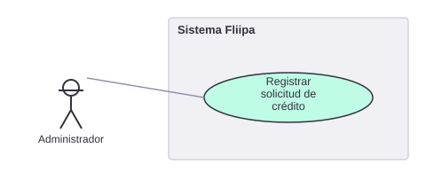

# 1. Registrar una solicitud de crédito

[← Volver a Casos De Uso](README.md)

## Diagrama de caso de uso

Actor principal: **cliente empresarial**.

> ⚠️ **Corrección (2026-07-30):** el actor original documentado era el administrador. Al revisar el código (`credits-platform-main`), la solicitud la crea el propio cliente empresarial desde `apps/checkout` — no existe ningún módulo de creación de solicitud en `apps/admin`. El diagrama de esta página aún no refleja este cambio (ver advertencia en el archivo SVG).

Objetivo: capturar una nueva solicitud de crédito para un cliente empresarial.

Flujo principal:
1. El cliente empresarial ingresa a la aplicación de checkout.
2. Inicia una nueva solicitud (o retoma una existente en estado `REQUEST_STARTED`).
3. Registra la información de su empresa y de su representante legal.
4. El sistema registra el estado inicial de la solicitud.

**Fuente:** `apps/checkout/actions/*` (`create-checkout.ts`).
