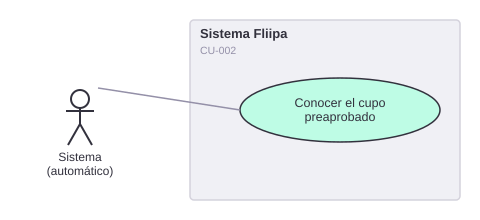

# 2. Evaluar riesgo

[← Volver a Casos De Uso](README.md)

## Diagrama de caso de uso

Actor principal: **sistema (motor de reglas automático)**.

> ⚠️ **Corrección (2026-07-30):** el actor original documentado era el administrador, y una revisión previa de este mismo caso de uso llegó a marcarlo como "no verificable en el repositorio", lo cual también era incorrecto: esa revisión no había cubierto la carpeta `services/`. Sí existe un motor de evaluación de riesgo automatizado.

Objetivo: analizar si la solicitud cumple con criterios de negocio y riesgo.

Flujo principal:
1. El sistema obtiene los datos de comportamiento comercial y transaccional del cliente (histórico de compras D1: `total_compras`, `num_compras`, `num_tiendas`).
2. El motor de reglas evalúa reglas duras y ponderadas sobre esos datos.
3. El sistema clasifica automáticamente el resultado en `PASS` (procede), `REVIEW` (requiere revisión adicional) o `REJECTED` (no procede).
4. En paralelo, el sistema consulta fuentes externas de riesgo (Experian, Datacrédito) para complementar la evaluación.

**Fuente:** `services/product/rules-engine/src/utils/evaluate-rule.ts`, `services/product/rules-engine/src/rule-models/b2b-base-preapproval.ts`, `services/product/evaluations/src/third-party/*`.
