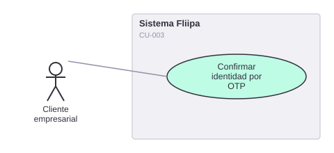

# CU-003. Confirmar identidad por OTP

[← Volver a Casos De Uso](README.md)

## Diagrama de caso de uso

Actor principal: **cliente empresarial**.

Objetivo: confirmar la identidad del cliente mediante un código de un solo uso (OTP) antes de continuar con el onboarding.

Flujo principal:
1. El sistema genera y envía un código OTP al cliente (WhatsApp, correo o SMS, según el canal configurado).
2. El cliente ingresa el código recibido.
3. El sistema valida que el código corresponda exactamente al generado para ese checkout y no haya expirado.
4. Si la validación es correcta, el cliente avanza a la siguiente etapa del onboarding.

**Fuente:** `backends/b2b/src/controllers/otp/validate-otp.ts`, `backends/b2b/src/controllers/otp/send-otp.ts`.

**Historias de usuario relacionadas:** HU-003 (confirmar identidad por OTP).
**Requerimientos relacionados:** RF-006.

> 🔴 **Hallazgo de seguridad (crítico, ver RNF-001):** el código de validación de OTP acepta un código comodín hardcodeado (`"490831"`, truncado al largo esperado) que valida como correcto cualquier OTP, sin importar el código real generado. Ver [Requerimientos No Funcionales, RNF-001](../04-requerimientos/02-requerimientos-no-funcionales.md).
>
> 🔴 **Hallazgo adicional (ver RNF-007):** el canal SMS responde `success: true` sin enviar realmente el mensaje (`console.warn("SMS channel not implemented yet")`), lo que puede ocultar fallas reales de entrega si ese canal está configurado como activo.
