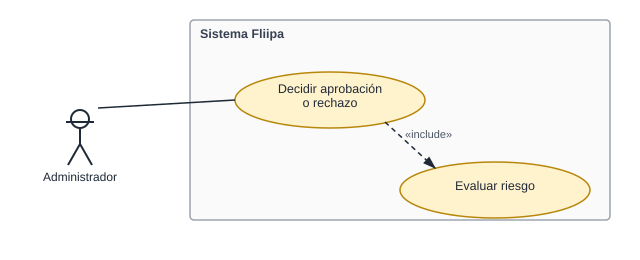

# 3. Decidir aprobación o rechazo

[← Volver a Casos De Uso](README.md)

## Diagrama de caso de uso

Actor principal: **sistema (automático)**, con posibilidad de intervención manual del **administrador**.

> ⚠️ **Corrección (2026-07-30):** el actor original documentado era únicamente el administrador; una revisión previa de este caso de uso lo marcó como "no verificable", lo cual también era incorrecto. La decisión real es mixta: el sistema puede aprobar automáticamente a partir de la evaluación del motor de reglas, y el administrador puede además cambiar manualmente el estado de la línea de crédito (incluyendo a `approved` o `rejected`) desde el panel administrativo, si tiene el permiso correspondiente.

Objetivo: tomar una decisión formal sobre la solicitud, ya sea de forma automática o mediante una acción manual del administrador.

Flujo principal (automático):
1. El sistema recibe la evaluación del cliente desde el motor de reglas (CU-2).
2. Si la evaluación es favorable, el sistema crea la línea de crédito con el cupo aprobado (`lineCap`).
3. Si ya existe una línea de crédito activa para el cliente, el sistema rechaza la operación e informa el conflicto.

Flujo alterno (manual):
1. El administrador ingresa al detalle de la línea de crédito en el panel administrativo.
2. Si cuenta con el permiso `CORE_UPDATE_STATUS`, puede cambiar manualmente el estado de la línea de crédito (por ejemplo, a `approved` o `rejected`) mediante un selector con confirmación.

**Fuente:** `services/core/credit-line-approval/src/services/approve-credit-line.service.ts`, `services/core/credit-line-status-update/src/services/update-credit-line-status.service.ts`, `apps/admin/src/components/status-selector.tsx`, `apps/admin/src/app/credit-lines/[id]/page.tsx` (`allowCreditLineStatusChange = can(CORE_ACTIONS_PERMISSIONS.CORE_UPDATE_STATUS)`).

> Nota: no se encontró en el código ningún concepto de "fiducia" para el fondeo del cupo (ver RF-015 en Requerimientos Funcionales); esa parte del proceso probablemente vive fuera de este repositorio.
