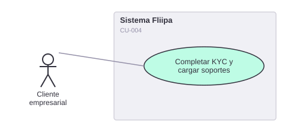

# CU-004. Completar KYC y cargar soportes desde el celular

[← Volver a Casos De Uso](README.md)

## Diagrama de caso de uso

Actor principal: **cliente empresarial**.

Objetivo: capturar los soportes de identidad del cliente (documento y selfie) requeridos para el proceso de KYC.

Flujo principal:
1. El cliente captura la foto de su cédula (frente y reverso) desde la cámara del celular.
2. El cliente captura una selfie.
3. El sistema almacena las fotos asociadas al checkout.
4. Un administrador o analista de riesgo puede revisar posteriormente las fotos cargadas.

**Fuente:** `apps/checkout/app/checkout/[id]/steps/IdPhotoStep.tsx`, `apps/checkout/app/checkout/[id]/steps/SelfieStep.tsx`, `apps/checkout/actions/clients/load-photo.ts`, `backends/b2b/src/services/upload-checkout-photo.ts`, `backends/b2b/src/repositories/gcp-photos-bucket.ts`.

**Historias de usuario relacionadas:** HU-004 (completar KYC y cargar soportes desde el celular).
**Requerimientos relacionados:** RF-008.

> ⚠️ **Hallazgo:** el proceso de captura funciona (fotos se suben y quedan disponibles para revisión en `apps/admin` — ver [CU-005](05-resolver-kyc-en-revision.md)), pero **no hay ningún proveedor de biometría automatizado** en el código: ni Olimpia (el proveedor citado en la documentación de negocio y técnica), ni ningún otro. La validación de identidad hoy depende enteramente de la revisión manual de las fotos, no de un algoritmo de verificación facial.
