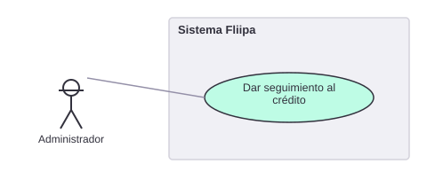

# 4. Dar seguimiento al crédito

[← Volver a Casos De Uso](README.md)

## Diagrama de caso de uso

Actor principal: administrador.

Objetivo: registrar y monitorear el cumplimiento del crédito una vez aprobado.
