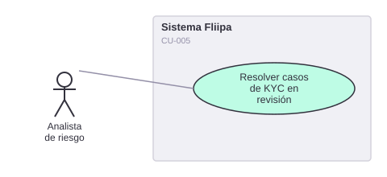

# CU-005. Resolver manualmente casos de KYC en revisión

[← Volver a Casos De Uso](README.md)

## Diagrama de caso de uso

Actor principal: **analista de riesgo**.

Objetivo: revisar manualmente los soportes de KYC de un cliente para decidir si puede continuar el proceso.

Flujo principal (según la documentación de negocio, **no confirmado en el código**):
1. El analista de riesgo visualiza los casos marcados "en revisión".
2. El analista revisa las fotos del documento y la selfie del cliente.
3. El analista registra la decisión (continuar o rechazar) y el cliente es notificado.

**Fuente parcial:** `apps/admin/src/app/product/clients/[id]/components/client-photos-tab.tsx` (permite ver las fotos cargadas por cliente).

**Historias de usuario relacionadas:** HU-016 (resolver manualmente casos de biometría en revisión).
**Requerimientos relacionados:** RF-008.

> ⚠️ **Hallazgo:** el panel admin sí permite **ver** las fotos de un cliente, pero no se encontró en el código ningún estado formal "en revisión" para KYC/biometría, ninguna cola de casos pendientes, ni un flujo explícito de decisión (continuar/rechazar) asociado a esa revisión. La búsqueda de términos como "en_revision", "manual_review" o "under_review" en todo el repositorio no arrojó resultados. Hoy la "revisión manual" se reduce a que un administrador puede consultar las fotos; el resto del flujo descrito en la historia de usuario no tiene respaldo verificable en `credits-platform-main`.
