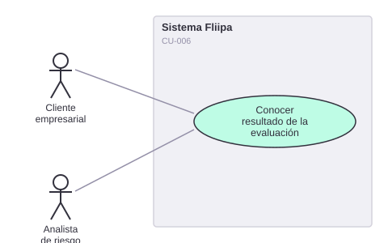

# CU-006. Conocer el resultado de la evaluación y consultar score, Experian y D1

[← Volver a Casos De Uso](README.md)

## Diagrama de caso de uso

Actor principal: **cliente empresarial** (conocer el resultado), **analista de riesgo** (consultar el detalle).

Objetivo: comunicar al cliente el resultado de su evaluación de riesgo en un plazo razonable, y permitir al analista de riesgo consultar el score, Experian y el histórico D1 para validar o ajustar la decisión automática.

Flujo principal:
1. El sistema consulta Experian (validación de empresa/persona, MidecisorPJ) y Datacrédito (score) para el cliente.
2. El sistema consulta también el histórico transaccional D1 (ver [CU-002](02-evaluar-riesgo.md)).
3. El cliente recibe la comunicación del resultado (aprobado, rechazado o en revisión).
4. El analista de riesgo puede consultar, por separado, el resultado de Experian, el score de Datacrédito y el histórico D1 de un cliente dado.

**Fuente:** `services/product/evaluations/src/third-party/Experian/*`, `services/product/evaluations/src/third-party/Datacredito/*`, `services/product/evaluations/src/routes.ts`.

**Historias de usuario relacionadas:** HU-005 (conocer el resultado en máximo 72 horas), HU-017 (ver score, Experian y D1 en un solo lugar).
**Requerimientos relacionados:** RF-010, RF-011, RF-012.

> ⚠️ **Hallazgos:**
> - 4 de 6 archivos de la integración con Experian son mocks explícitos (`USE_MOCK = true` o comentario `// Mock`); solo la consulta de score vía Datacrédito no está mockeada.
> - No existe ninguna pantalla o endpoint que **consolide en un solo lugar** Experian + histórico D1 + score para el analista de riesgo; cada dato se consulta por endpoints separados.
> - El plazo de "máximo 72 horas" (HU-005) no está enforced ni medido en ningún lugar del código revisado.
