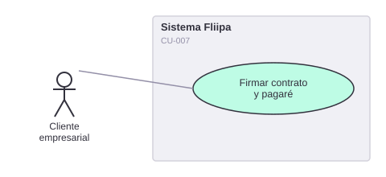

# CU-007. Firmar contrato desde el celular

[← Volver a Casos De Uso](README.md)

## Diagrama de caso de uso

Actor principal: **cliente empresarial**.

Objetivo: permitir al cliente firmar digitalmente el contrato de su línea de crédito desde el celular.

Flujo principal:
1. El sistema genera el contrato del cliente.
2. El cliente recibe un código de verificación para confirmar la firma.
3. El cliente ingresa el código y firma digitalmente.
4. Si se agotan los intentos permitidos, el sistema bloquea temporalmente la firma para prevenir fuerza bruta.

**Fuente:** `apps/redemption/actions/sign-contract.ts`, `backends/b2b/src/config/constants.ts` (`signatureValidityMs`, `blockDurationMs`).

**Historias de usuario relacionadas:** HU-006 (firmar contrato desde el celular).
**Requerimientos relacionados:** RF-013, RF-014.

> ✅ Confirmado en código: el bloqueo tras agotar intentos existe y dura 24 horas (`blockDurationMs`), consistente con [RNF-013](../04-requerimientos/02-requerimientos-no-funcionales.md).

> ⚠️ **Nota (2026-08-04):** el nombre de archivo y de la fuente del diagrama (`07-firmar-contrato-pagare`) conserva la palabra "pagare" por continuidad de identificadores (CU-007, HU-006, RF-013/014 ya referencian esta ruta en otros documentos); el contenido ya no menciona el pagaré porque, según confirmación de negocio, no aplica al producto vigente. Pendiente: verificar en `apps/redemption/actions/sign-contract.ts` si el backend todavía genera o exige un pagaré, para descartar el concepto también a nivel técnico si corresponde.
