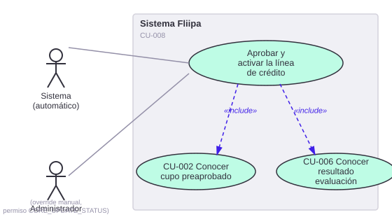

# CU-008. Aprobar y activar la línea de crédito

[← Volver a Casos De Uso](README.md)

## Diagrama de caso de uso

> 📌 **Nota de numeración (2026-07-30):** este caso de uso llena un vacío que existía en la numeración de [Historias de Usuario](../03-historias-usuario/README.md): ningún documento hacía referencia explícita a "CU-008", aunque sí existe una capacidad real en el código que encaja aquí, entre la firma del contrato ([CU-007](07-firmar-contrato-pagare.md)) y la consulta del cupo activo ([CU-009](09-consultar-cupo-plan-pagos.md)). También reemplaza el contenido de lo que antes se documentaba, sin numeración formal, como "caso de uso 3: decidir aprobación o rechazo".

Actor principal: **sistema (automático)**, con posibilidad de intervención manual del **administrador** (ver [CU-015](15-buscar-cliente-ajustar-cupo.md)).

Objetivo: aprobar y activar la línea de crédito del cliente una vez completada la evaluación de riesgo y firmado el contrato.

Flujo principal (automático):
1. El sistema recibe la evaluación del cliente desde el motor de reglas ([CU-002](02-evaluar-riesgo.md), [CU-006](06-conocer-resultado-evaluacion.md)).
2. Si la evaluación es favorable, el sistema crea la línea de crédito con el cupo aprobado (`lineCap`).
3. Si ya existe una línea de crédito activa para el cliente, el sistema rechaza la operación e informa el conflicto.

**Fuente:** `services/core/credit-line-approval/src/services/approve-credit-line.service.ts`, `services/core/credit-line-status-update/src/services/update-credit-line-status.service.ts`.

**Requerimientos relacionados:** RF-012, RF-015.

> ⚠️ **Hallazgo:** no se encontró en el código ningún concepto de "fiducia" para el fondeo del cupo (RF-015 en Requerimientos Funcionales); esa parte del proceso, si existe, vive fuera de este repositorio.
