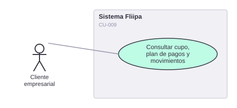

# CU-009. Consultar cupo, plan de pagos y movimientos

[← Volver a Casos De Uso](README.md)

## Diagrama de caso de uso

Actor principal: **cliente empresarial**.

Objetivo: permitir al cliente consultar el estado de su cupo, su plan de pagos y sus movimientos.

Flujo principal:
1. El cliente ingresa a su panel en `apps/redemption`.
2. Consulta el estado de su línea de crédito y el saldo disponible.
3. Consulta su plan de pagos simulado.
4. Consulta el historial de movimientos (compras, pagos).

**Fuente:** `apps/redemption/actions/simulate-payment-plan.ts`, `apps/redemption/components/pages/dashboard/MovementItem.tsx`, `apps/redemption/app/onboarding/payment-plan`.

**Historias de usuario relacionadas:** HU-007 (consultar cupo, plan de pagos y movimientos).
**Requerimientos relacionados:** RF-016, RF-017.
