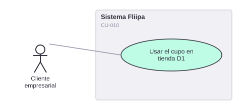

# CU-010. Usar el cupo en tienda D1

[← Volver a Casos De Uso](README.md)

## Diagrama de caso de uso

Actor principal: **cliente empresarial**.

Objetivo: permitir al cliente usar su cupo disponible para pagar una compra en tienda D1.

Flujo principal:
1. El cliente genera o recupera un código QR dinámico asociado a su cupo.
2. Alternativamente, el cliente revela un código de compra como mecanismo alterno de canje.
3. El sistema valida el código/QR en el punto de pago y descuenta el monto del cupo disponible.

**Fuente:** `services/product/qr-manager/src/controllers/get-or-create-qr.ts`, `validate-qr.ts`; `apps/redemption/actions/reveal-purchase-code.ts`; `backends/b2b` (`clients/get-client-coupon.ts`).

**Historias de usuario relacionadas:** HU-008 (usar el cupo en tienda D1).
**Requerimientos relacionados:** RF-019, RF-020.

> ⚠️ **Hallazgo:** coexisten dos mecanismos de canje (QR dinámico y código de compra) sin que la documentación de negocio aclare cuál es el vigente o si ambos coexisten intencionalmente.
