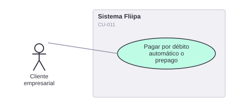

# CU-011. Pagar por débito automático o prepago

[← Volver a Casos De Uso](README.md)

## Diagrama de caso de uso

Actor principal: **cliente empresarial**.

Objetivo: permitir al cliente pagar su cuota mediante débito automático (Druo) o mediante prepago voluntario.

Flujo principal:
1. El cliente vincula su cuenta bancaria durante el onboarding.
2. En la fecha de corte, el sistema intenta el débito automático a través de Druo.
3. Druo notifica el resultado de la transacción mediante webhook.
4. Alternativamente, el cliente puede prepagar antes de la fecha de corte.
5. El sistema registra el pago y actualiza el saldo del cupo.

**Fuente:** `services/core/payments/src/services/create-payment.ts`, `services/product/webhooks/src/controllers/webhooks/druo-events.webhook.ts`, `services/product/webhooks/src/services/druo/transaction-successful.handler.ts`, `apps/checkout/app/checkout/[id]/steps/BankAccountStep.tsx`.

**Historias de usuario relacionadas:** HU-009 (pagar por débito automático o prepago).
**Requerimientos relacionados:** RF-022.

> ⚠️ **Hallazgo:** el manejador del webhook de transacción exitosa de Druo (`druoTransactionSuccessfulHandler`) actualmente solo registra la información en el log (`console.log`) y no ejecuta ninguna acción adicional (no se confirmó que actualice el registro de pago o el saldo del cupo desde ese webhook específico); conviene revisar con el equipo técnico si esa actualización ocurre por otra vía.
