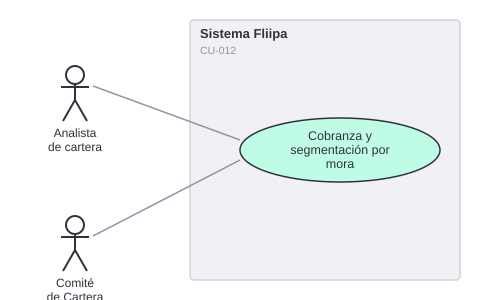

# CU-012. Cobranza y segmentación por mora

[← Volver a Casos De Uso](README.md)

## Diagrama de caso de uso

Actor principal: **analista de cartera**, **Comité de Cartera**.

Objetivo: segmentar la cartera por bucket de mora y registrar cada interacción de cobranza para priorizar la gestión.

Flujo principal (según la documentación de negocio):
1. El analista de cartera consulta la cartera segmentada por bucket de mora (pago anticipado, buckets 1 a 5).
2. El analista prioriza su gestión de cobro diaria según esa segmentación.
3. El analista registra cada interacción de cobranza (canal, resultado, compromiso de pago).
4. El Comité de Cartera consulta semanalmente un tablero con los casos priorizados.

**Fuente parcial:** `backends/b2b/src/controllers/clients/collection-notes.ts` (`getCollectionNotesAttentionSummary`).

**Historias de usuario relacionadas:** HU-018 (ver cartera segmentada por bucket de mora), HU-019 (registrar cada interacción de cobranza), HU-020 (tablero semanal de priorización).
**Requerimientos relacionados:** RF-025, RF-026.

> ✅ **Confirmado:** el registro de interacciones de cobranza (paso 3) sí está completamente implementado — creación, edición, eliminación y listado de notas, más un resumen de atención por cliente.
>
> ⚠️ **Hallazgo:** no se encontró en el código ninguna lógica de segmentación por "bucket de mora" (pasos 1, 2 y 4). Se buscó exhaustivamente "bucket" y "mora" en todo el repositorio; las únicas coincidencias de "bucket" corresponden a buckets de almacenamiento GCP para fotos, sin relación con cartera. El motor de reglas (`rules-engine`) existente está enfocado en preaprobación, no en cobranza. Esta segmentación, si existe, vive en un sistema externo no incluido en este repositorio.
