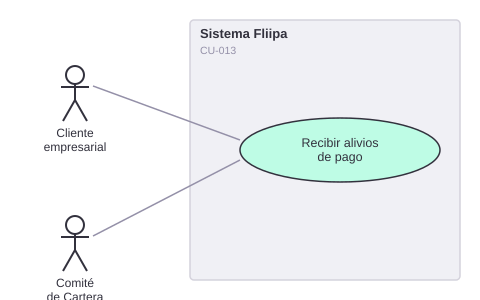

# CU-013. Alivios de pago

[← Volver a Casos De Uso](README.md)

## Diagrama de caso de uso

Actor principal: **cliente empresarial**, **Comité de Cartera**.

Objetivo: permitir que un cliente con dificultades temporales de pago acceda a un alivio (abono parcial, congelamiento de intereses o condonación), priorizado semanalmente por el Comité de Cartera.

Flujo principal (según la documentación de negocio, **no confirmado en el código**):
1. El cliente con dificultades de pago solicita o recibe una propuesta de alivio.
2. El sistema (o el Comité) determina qué tipo de alivio aplica según el bucket de mora del cliente.
3. El cliente accede al abono parcial, congelamiento de intereses o condonación, según las condiciones y topes definidos.

**Historias de usuario relacionadas:** HU-010 (recibir alivios ante dificultades de pago), HU-020 (tablero semanal de priorización, ver también [CU-012](12-cobranza-segmentacion-mora.md)).
**Requerimientos relacionados:** ninguno asignado directamente en Requerimientos Funcionales.

> ⚠️ **Hallazgo:** no se encontró en el código ningún módulo de alivios, condonación, ni la lógica de "bucket de mora" de la que depende (búsqueda exhaustiva de "bucket", "mora", "condona*", "alivio*" en todo el repositorio, sin coincidencias relevantes). Esta funcionalidad parece no estar implementada en `credits-platform-main`, o vive en un sistema externo o en un proceso manual.
