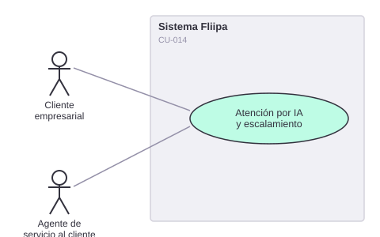

# CU-014. Atención por IA, escalamiento y validación en casos críticos

[← Volver a Casos De Uso](README.md)

## Diagrama de caso de uso

Actor principal: **cliente empresarial**, **asistente virtual (IA)**, **agente de servicio al cliente**.

Objetivo: resolver dudas del cliente mediante un asistente virtual, escalando a un agente humano con contexto completo cuando sea necesario, y validando la identidad en casos críticos (suplantación, uso indebido del cupo).

Flujo principal (según la documentación de negocio, **no confirmado en el código**):
1. El cliente contacta por WhatsApp con una duda o reclamo.
2. Un asistente virtual basado en IA atiende el primer contacto.
3. Si no resuelve el caso, escala a un agente humano junto con el contexto completo de la conversación.
4. En casos críticos, el agente exige validación de identidad y aprobación manual explícita antes de cerrar el caso.

**Fuente parcial:** `services/product/communications/src/controllers/whatsapp/whatsapp.controller.ts` (envío de mensajes WhatsApp).

**Historias de usuario relacionadas:** HU-011 (resolver dudas por WhatsApp), HU-022 (recibir el caso escalado con contexto completo), HU-023 (validar identidad en casos críticos).
**Requerimientos relacionados:** RF-028, RF-029.

> ⚠️ **Hallazgo:** el microservicio `communications` existe, pero sus controladores están limitados al envío de OTP, firma y contrato por WhatsApp/correo. **No se encontró ningún módulo de asistente conversacional de IA, ni lógica de escalamiento a un agente humano, ni de validación de identidad en casos críticos** en ningún servicio revisado (se buscó "chatbot", "asistente virtual", "openai", "llm" en todo el repositorio, sin resultados). Esta funcionalidad probablemente vive en una herramienta externa no incluida en este repositorio.
