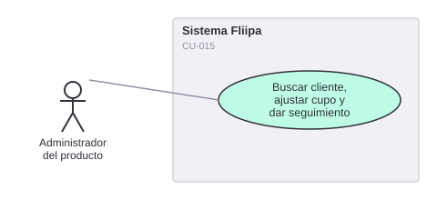

# CU-015. Buscar cliente, ver historial auditado, ajustar cupo o fecha de corte, y dar seguimiento al crédito

[← Volver a Casos De Uso](README.md)

## Diagrama de caso de uso

> 📌 **Nota de reorganización (2026-07-30):** este caso de uso absorbe dos contenidos que antes se documentaban por separado y sin numeración formal: "caso de uso 3: decidir aprobación o rechazo" (la parte manual, ejecutada por el administrador) y "caso de uso 4: dar seguimiento al crédito". Ambos son, en la práctica, acciones del mismo panel administrativo (`apps/admin`) sobre la misma línea de crédito, y corresponden a las historias de usuario HU-024 y HU-025. El diagrama se rehizo para reflejar este caso de uso consolidado.

Actor principal: **administrador del producto**, con apoyo del **analista de cartera** para el seguimiento.

Objetivo: permitir al administrador buscar un cliente, consultar su historial auditado, ajustar el cupo o la fecha de corte de su línea de crédito, cambiar manualmente su estado (incluyendo aprobar o rechazar), y hacer seguimiento al crédito una vez aprobado.

Flujo principal:
1. El administrador busca un cliente por documento.
2. Consulta su historial completo de operaciones auditadas (línea de crédito, desembolsos, pagos).
3. Si tiene el permiso `CORE_UPDATE_STATUS`, puede cambiar manualmente el estado de la línea de crédito (por ejemplo, a `approved`, `rejected`, `active` o `frozen`) mediante un selector con confirmación.
4. Puede ajustar el cupo (`lineCap`) o la fecha de corte (`cutoffDay`) de la línea de crédito.
5. Consulta el estado del crédito, el plan de pagos y el saldo disponible para dar seguimiento.

**Fuente:** `backends/admin/src/controllers/clients.controller.ts` (`getClientAuditedOperations`), `backends/admin/src/controllers/credit-lines.controller.ts`, `apps/admin/src/components/status-selector.tsx`, `apps/admin/src/app/credit-lines/[id]/page.tsx` (`allowCreditLineStatusChange = can(CORE_ACTIONS_PERMISSIONS.CORE_UPDATE_STATUS)`).

**Historias de usuario relacionadas:** HU-024 (buscar cliente y ver historial auditado), HU-025 (ajustar cupo o fecha de corte).
**Requerimientos relacionados:** RF-018, RF-030, RF-031.

> ⚠️ **Hallazgo:** el admin acepta `cutoffDay` en un rango de 0 a 31, mientras que el módulo de redemption exige 1 a 31 — discrepancia real entre ambos módulos.
