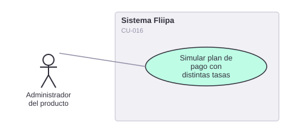

# CU-016. Simular plan de pago con distintas tasas

[← Volver a Casos De Uso](README.md)

## Diagrama de caso de uso

Actor principal: **administrador del producto**.

Objetivo: simular el plan de pago diario de un cliente en mora con distintas tasas, para preparar acuerdos de pago o alivios.

Flujo principal:
1. El administrador ingresa la tasa corriente, la tasa de mora y el umbral de días.
2. El sistema calcula el plan de pago diario resultante.
3. El administrador descarga el resultado en un archivo CSV.

**Fuente:** `backends/admin/src/controllers/calculator.controller.ts` (`getCalculatorStatus`, recibe `currentInterestRate`, `overdueInterestRate`, `thresholdDays`), `apps/admin/src/lib/generate-csv-file.ts`, `apps/admin/src/app/disbursements/consult/CalculatorDownloaderButton.tsx`.

**Historias de usuario relacionadas:** HU-026 (simular plan de pago con distintas tasas).
**Requerimientos relacionados:** RF-024.

> ✅ Confirmado en código con exactitud: los tres campos (tasa corriente, tasa de mora, umbral de días) y la descarga CSV existen tal como los describe la historia de usuario.
