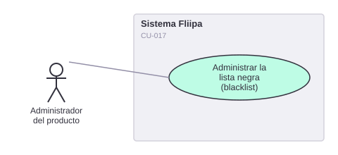

# CU-017. Administrar la lista negra (blacklist)

[← Volver a Casos De Uso](README.md)

## Diagrama de caso de uso

Actor principal: **administrador del producto**.

Objetivo: agregar o retirar clientes de la lista negra, para bloquear casos de fraude confirmado.

Flujo principal:
1. El administrador busca al cliente por documento.
2. Agrega o retira al cliente de la blacklist.
3. El sistema valida que el cliente exista antes de aplicar el cambio.

**Fuente:** `backends/b2b/src/controllers/blacklist/add-client-to-blacklist.ts`, `backends/b2b/src/controllers/blacklist/remove-client-client-from-blacklist.ts`.

**Historias de usuario relacionadas:** HU-027 (administrar la lista negra).
**Requerimientos relacionados:** RF-027.

> 🔴 **Hallazgo de negocio confirmado:** agregar o retirar un cliente de la blacklist **no tiene ningún efecto bloqueante** en el resto del sistema. La relación `blacklists` solo se usa para mostrar datos (`get-client-by-id.service.ts`); no se encontró ningún `if` que bloquee el checkout, la evaluación de riesgo o el desembolso por estar en la blacklist. Esto es un riesgo de negocio real: hoy la blacklist es solo informativa.
