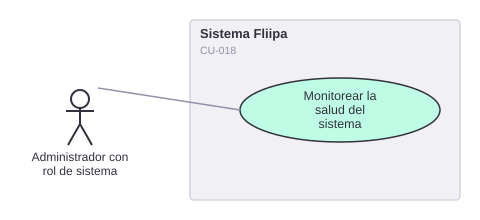

# CU-018. Monitorear la salud del sistema en tiempo real

[← Volver a Casos De Uso](README.md)

## Diagrama de caso de uso

Actor principal: **administrador con rol de sistema (SYS_ADMIN)**.

Objetivo: consultar en tiempo real la disponibilidad y latencia del core bancario, la base de datos y los proveedores externos, para detectar incidentes antes de que afecten a los clientes.

Flujo principal:
1. El administrador de sistema abre el panel de salud del sistema.
2. Consulta la disponibilidad y latencia del core bancario y de Cloud SQL.
3. Consulta la disponibilidad de proveedores externos.

**Fuente:** `backends/admin/src/services/system-core-health.service.ts`, `cloud-sql-status.service.ts`, `backends/admin/src/controllers/system-third-party-status.controller.ts`, `backends/admin/src/services/system-third-party-status.service.ts`.

**Historias de usuario relacionadas:** HU-028 (monitorear salud del sistema en tiempo real).
**Requerimientos relacionados:** RF-033.

> ⚠️ **Hallazgo:** el monitoreo de terceros implementado cubre únicamente GitHub, npm, Git y GCP. **No cubre Experian, Druo, Zenvia/Sendgrid, ningún proveedor de biometría ni el core bancario**, a pesar de que son las integraciones críticas para el negocio descritas en [Alcance del Producto](../../producto/alcance.md).
