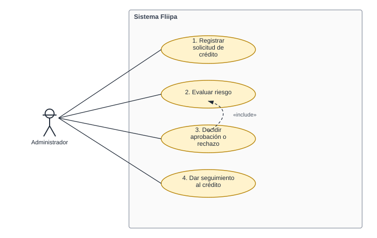

# Casos De Uso

| Documento | Casos De Uso |
|-----------|----------------|
| **Proyecto** | Fliipa |
| **Versión** | 2.3 |
| **Estado** | En revisión |
| **Responsable** | Producto y QA |
| **Última actualización** | 2026-07-29 |

---

## Control de versiones

| Versión | Fecha | Autor | Descripción |
|---------|-------|-------|-------------|
| 0.1 | 2026-07-07 | Producto y QA | Primera versión: 4 casos de uso narrativos, sin identificador formal, centrados en el actor administrador. |
| 2.0 | 2026-07-29 | Revisión asistida por Claude | Reorganización: un archivo por caso de uso, siguiendo el mismo formato usado en [Actores](../../negocio/Actores/README.md) y [Procesos](../../negocio/procesos/README.md). Se preserva el contenido original sin modificarlo. **Pendiente (ver Informe de Validación Funcional del 29 jul 2026):** ampliar de 4 a los 18 casos de uso (CU-001 a CU-018) que ya referencia [Historias de Usuario](../03-historias-usuario/README.md), asignar numeración `CU-XXX` formal, y cubrir los actores y procesos que hoy faltan (cliente empresarial, asesor de servicio al cliente, analista de riesgo, analista de cartera, agente de servicio al cliente). |
| 2.1 | 2026-07-29 | Revisión asistida por Claude | Se agrega un diagrama de caso de uso (Mermaid `flowchart`) en cada archivo individual y un diagrama combinado en este README, con la relación «include» entre CU-3 y CU-2. |
| 2.2 | 2026-07-29 | Revisión asistida por Claude | Se reemplazan los diagramas Mermaid por diagramas de caso de uso UML reales (SVG, carpeta `diagramas/`): actor con notación de monigote, casos de uso como óvalos dentro del límite del sistema, y relación «include» con flecha punteada, siguiendo la notación estándar de casos de uso. |
| 2.3 | 2026-07-29 | Revisión asistida por Claude | Se ajusta la paleta de los diagramas a los colores de marca (teal `#5AF8BD` / `#BEFCE5` para los casos de uso, azul `#3F1FE8` para la relación «include», gris para actor y estructura). Se agrega [00-caso-de-uso-general.md](00-caso-de-uso-general.md): documento que describe el caso de uso "paraguas" que agrupa CU-1 a CU-4 como un único flujo de gestión de la solicitud de crédito. |

---

## Objetivo

Definir los escenarios principales de interacción entre los actores y el sistema de Fliipa.

## Alcance

Este documento presenta los casos de uso relevantes para la primera versión del sistema. **Estado actual:** cubre únicamente el proceso de evaluación y decisión de crédito desde la perspectiva del administrador; no cubre aún los 11 procesos de negocio definidos en [Alcance del Producto](../../producto/alcance.md) ni los demás actores documentados en [Actores](../../negocio/Actores/README.md).

## Diagrama de casos de uso

> El caso de uso 3 (*Decidir aprobación o rechazo*) incluye al caso de uso 2 (*Evaluar riesgo*): no se puede decidir sin haber evaluado el riesgo primero. Los demás casos son independientes entre sí.

## Casos de uso

| # | Caso de uso | Actor principal | Documento |
|---|--------------|------------------|-----------|
| — | **Caso de uso general** (agrupa el 1 al 4) | Administrador | [00-caso-de-uso-general.md](00-caso-de-uso-general.md) |
| 1 | Registrar una solicitud de crédito | Administrador | [01-registrar-solicitud-credito.md](01-registrar-solicitud-credito.md) |
| 2 | Evaluar riesgo | Administrador | [02-evaluar-riesgo.md](02-evaluar-riesgo.md) |
| 3 | Decidir aprobación o rechazo | Administrador | [03-decidir-aprobacion-rechazo.md](03-decidir-aprobacion-rechazo.md) |
| 4 | Dar seguimiento al crédito | Administrador | [04-seguimiento-credito.md](04-seguimiento-credito.md) |

## Documentos relacionados

- [Funcional](../README.md)
- [Flipa - Biblioteca de Conocimiento](../../README.md)
- [Mapa Del Conocimiento](../../MAPA_DEL_CONOCIMIENTO.md)
- [Onboarding](../../ONBOARDING.md)
- [Convenciones](../../CONVENCIONES.md)
- [Negocio](../../negocio/README.md)
- [Tecnico](../../tecnico/README.md)
- [Qa](../../qa/README.md)
- [Documento Funcional](../01-marco-funcional/01-documento-funcional.md)
- [Historias Usuario](../03-historias-usuario/README.md)
- [Requerimientos Funcionales](../04-requerimientos/funcionales/README.md)
- [Requerimientos No Funcionales](../04-requerimientos/no-funcionales/README.md)

## Responsable

Producto y QA

## Fuentes consultadas

- Contenido original: `funcional/02-casos-de-uso/01-casos-de-uso.md` (versión 2026-07-07).
