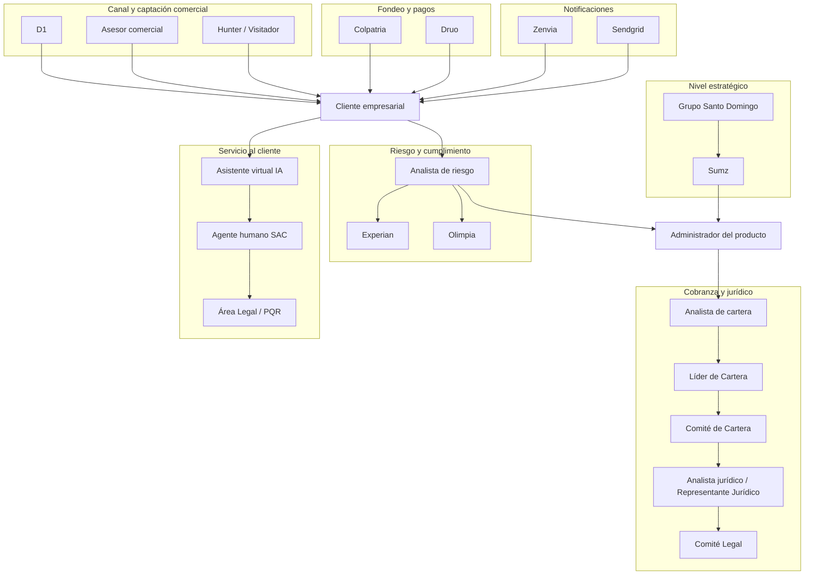

# 7. Diagrama: ecosistema de actores

[← Volver a Actores](README.md)

## Fuentes consultadas

- Elaboración propia a partir de Modelo Comercial B2B, Modelo y Proceso de Cobranza B2B, Investigación B2B y Journeys Colpatria B2B.
