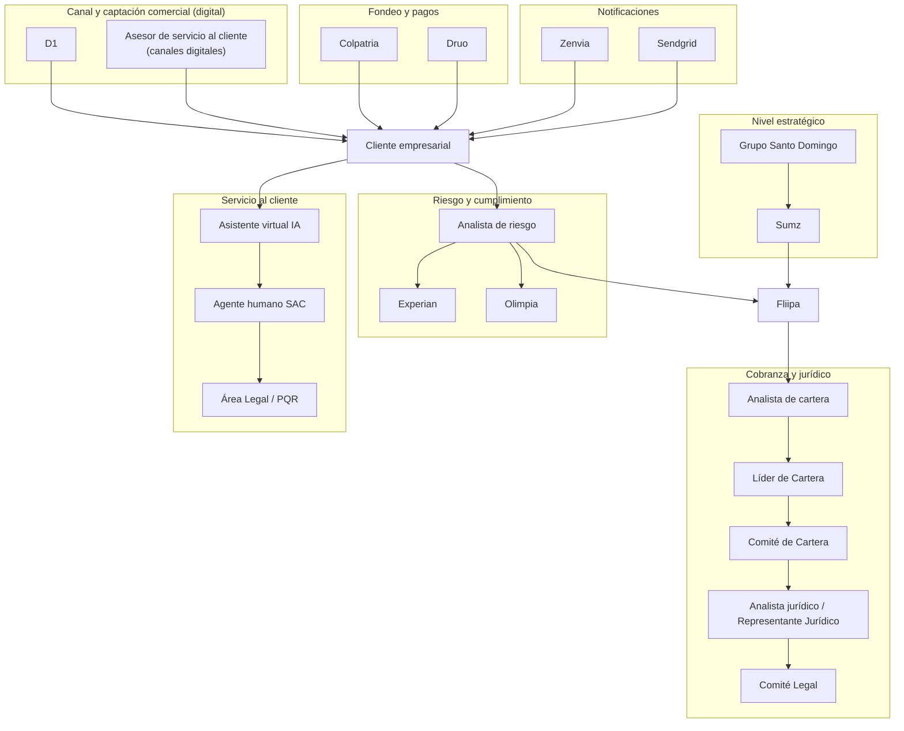

# 7. Diagrama: ecosistema de actores

[← Volver a Actores](README.md)

> **Nota (Check-in de Producto, 15 jul 2026):** se renombró el nodo "Administrador del producto" a **Fliipa**, se eliminó el nodo "Hunter / Visitador" (perfil no existente en el modelo 100% digital) y se renombró "Asesor comercial" a **"Asesor de servicio al cliente (canales digitales)"**, consistente con los ajustes de rol acordados en esa reunión.

## Fuentes consultadas

- Elaboración propia a partir de Modelo Comercial B2B, Modelo y Proceso de Cobranza B2B, Investigación B2B y Journeys Colpatria B2B.
- Notas de la reunión "Producto: Check-in" (15 jul 2026) y su transcripción asociada.
