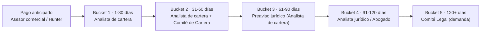

# 8. Diagrama: escalamiento de cobranza por bucket

[← Volver a Actores](README.md)

> Ver la nota de consistencia sobre los plazos de escalamiento jurídico frente al journey Colpatria en [04-comite-cartera.md](04-comite-cartera.md) y en [Procesos → 9. Gestión de cobranza](../procesos/09-cobranza.md).

## Fuentes consultadas

- Modelo y Proceso de Cobranza B2B
