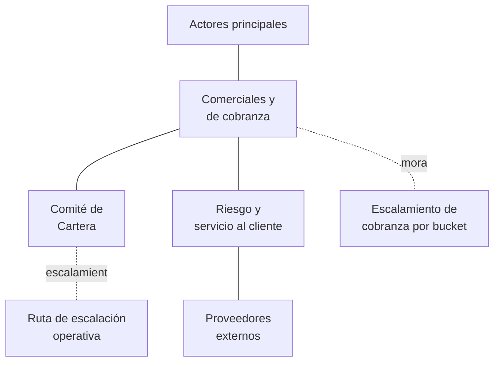

# Actores

| Documento | Actores |
|-----------|---------|
| **Proyecto** | Fliipa |
| **Versión** | 2.1 |
| **Estado** | En revisión |
| **Responsable** | Negocio y operaciones |
| **Última actualización** | 2026-07-17 |

---

## Control de versiones

| Versión | Fecha | Autor | Descripción |
|---------|-------|-------|-------------|
| 1.0 – 1.5 | 2026-07-07 a 2026-07-10 | María Fernanda Herazo | Historial completo en el `actores.md` original (monolítico): actores principales, comerciales, de cobranza, de riesgo y servicio al cliente, proveedores externos, Comité de Cartera, y los dos diagramas Mermaid. |
| 2.0 | 2026-07-14 | María Fernanda Herazo (con asistencia de Claude) | Reorganización: un archivo por categoría de actor, siguiendo el mismo formato usado en [Procesos](../procesos/README.md). Se corrige el enlace roto a `procesos.md#9-...` (apuntaba al archivo monolítico anterior) para que apunte a [../procesos/09-cobranza.md](../procesos/09-cobranza.md). |
| 2.1 | 2026-07-17 | María Fernanda Herazo (con asistencia de Claude) | Aplicación de acuerdos del Check-in de Producto (15 jul 2026): (1) reemplazo de "Administrador del producto" por **Fliipa** en el mapa resumen y el diagrama de ecosistema; (2) unificación de "Asesor comercial" en **"Asesor de servicio al cliente (canales digitales)"** en todos los documentos y diagramas; (3) eliminación del perfil **"Hunter / Visitador"**, inexistente en el modelo 100% digital; (4) eliminación del perfil **"Senior Credit Strategy Analyst"** del Comité de Cartera, con nota de que su composición final está pendiente de definir con Colpatria. |

---

## Objetivo

Presentar quién participa en el ecosistema de Fliipa — clientes, equipo interno, comercial, cobranza, riesgo, servicio al cliente y proveedores externos — y cómo se relacionan entre sí.

## Alcance

Cubre la identificación de actores, sus roles y fuentes, el Comité de Cartera, los diagramas de ecosistema y de escalamiento de cobranza, y la ruta de escalación operativa. No incluye las reglas de negocio que rigen sus decisiones (ver [Reglas Negocio](../reglas-negocio/README.md)) ni el detalle paso a paso de los procesos en los que participan (ver [Procesos](../procesos/README.md)).

## Mapa de categorías

Ver el detalle de cada actor y cada relación en el diagrama de [ecosistema completo](07-diagrama-ecosistema.md).

## Categorías de actores

| # | Categoría | Resumen | Documento |
|---|-----------|---------|-----------|
| — | Mapa de actores (resumen) | Tabla de una línea por categoría, con fuente principal. | [01-mapa-resumen.md](01-mapa-resumen.md) |
| 1 | Actores principales | Cliente empresarial, Fliipa, D1, Grupo Santo Domingo. | [02-actores-principales.md](02-actores-principales.md) |
| 2 | Actores comerciales y de cobranza | Asesor de servicio al cliente (canales digitales), Analista de cartera, Líder de cartera, Analista jurídico. | [03-actores-comerciales-cobranza.md](03-actores-comerciales-cobranza.md) |
| 3 | Comité de Cartera | Composición (pendiente de cerrar con Colpatria), funciones y nota de consistencia con el journey Colpatria. | [04-comite-cartera.md](04-comite-cartera.md) |
| 4 | Actores de riesgo y servicio al cliente | Analista de riesgo, IA, agente humano de SAC, áreas internas de escalamiento. | [05-riesgo-servicio-cliente.md](05-riesgo-servicio-cliente.md) |
| 5 | Proveedores externos | Experian, Druo, Olimpia, Zenvia, Sendgrid, Colpatria, Nebula. | [06-proveedores-externos.md](06-proveedores-externos.md) |
| 6 | Diagrama: ecosistema de actores | Mapa completo de relaciones entre todos los actores. | [07-diagrama-ecosistema.md](07-diagrama-ecosistema.md) |
| 7 | Diagrama: escalamiento de cobranza por bucket | Qué actor gestiona cada bucket de mora. | [08-diagrama-escalamiento-cobranza.md](08-diagrama-escalamiento-cobranza.md) |
| 8 | Ruta de escalación operativa | 5 niveles de escalación general (Investigación B2B). | [09-ruta-escalacion-operativa.md](09-ruta-escalacion-operativa.md) |

## Documentos relacionados

- [Negocio](../README.md)
- [Flipa - Biblioteca de Conocimiento](../../README.md)
- [Mapa Del Conocimiento](../../MAPA_DEL_CONOCIMIENTO.md)
- [Onboarding](../../ONBOARDING.md)
- [Convenciones](../../CONVENCIONES.md)
 - [Descripcion Negocio](../descripcion_negocio/README.md)
- [Procesos](../procesos/README.md)
- [Reglas Negocio](../reglas-negocio/README.md)
- [Indicadores](../indicadores/README.md)

## Fuentes consultadas

- Journeys Colpatria B2B, junio 2026 — *Journeys Fran finales-1.pdf* (págs. 3, 4, 9 y 10)
- Integraciones técnicas — Olimpia y Zenvia (`tecnico/Integraciones/Olimpia.md`, `tecnico/Integraciones/Zenvia.md`)
- Alcance del Producto (`producto/alcance.md`)
- Modelo Comercial B2B — *Modelo Comercial B2B.pptx*
- Modelo y Proceso de Cobranza B2B — *Modelo Cobranza/Modelo_de_Cobranza_B2B_.pptx* y *Modelo Cobranza/Modelo y gestion de cobranza.docx*
- Investigación B2B — *Modelo Cobranza/Investigacion B2B.docx*
- [Procesos](../procesos/README.md) y [Reglas Negocio](../reglas-negocio/README.md) — referenciados para la nota de consistencia sobre plazos de escalamiento jurídico
- Notas de la reunión "Producto: Check-in" (15 jul 2026) y su transcripción asociada.
