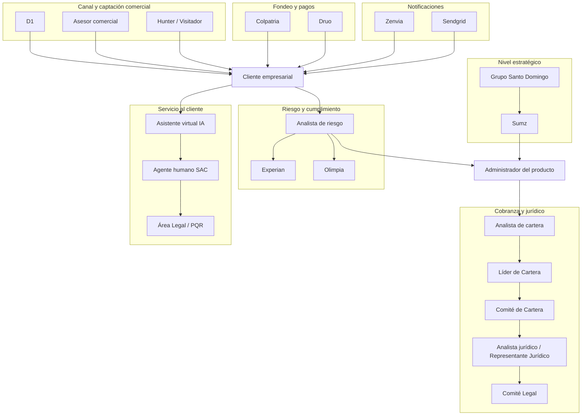
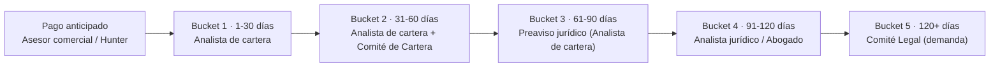

# Actores del negocio

| Documento | Actores del negocio |
|-----------|----------------------|
| **Proyecto** | Fliipa |
| **Versión** | 1.5 |
| **Estado** | En revisión |
| **Responsable** | Negocio y operaciones |
| **Última actualización** | 2026-07-10 |

---

## Control de versiones

| Versión | Fecha | Autor | Descripción |
|---------|-------|-------|-------------|
| 1.0 | 2026-07-07 | María Fernanda Herazo | Creación inicial del documento. |
| 1.1 | 2026-07-08 | María Fernanda Herazo | Se agregaron actores comerciales, de cobranza y proveedores externos. |
| 1.2 | 2026-07-08 | María Fernanda Herazo | Se agregaron Colpatria (core bancario/fiducia), analista de riesgo, agente de servicio al cliente y asistente virtual (IA), con base en los Journeys Colpatria B2B. |
| 1.3 | 2026-07-09 | María Fernanda Herazo | Se actualiza el proveedor de biometría (Olimpia, antes "por confirmar") y se agregan Zenvia y Sendgrid como proveedores externos de notificaciones, con base en los Journeys Colpatria B2B y la documentación técnica de integraciones. |
| 1.4 | 2026-07-09 | María Fernanda Herazo | Se corrige el bucket del analista jurídico/abogado (bucket 4, no bucket 3) y se ajustan las descripciones de Hunter/visitador y Analista de cartera para citar de forma precisa la fuente de cada rol, con base en el Modelo y Proceso de Cobranza B2B e Investigación B2B. |
| 1.5 | 2026-07-10 | María Fernanda Herazo (con apoyo de Claude) | Corrección solicitada por Iván: se elimina la sección "Fuentes consultadas" duplicada y se reubica el párrafo final sin formato dentro de "Flujo de interacción entre actores". Se agregan actores documentados en las fuentes que no estaban en la versión anterior — **Líder de Cartera** y **Comité Legal** (Investigación B2B), y **Área Legal/PQR** y **áreas internas de escalamiento** (Journeys Colpatria B2B, pág. 9). Se precisa el alcance del **Analista de riesgo**: el Journey Colpatria B2B (ajuste jun. 2026) indica que la evaluación de score/cupo ya es 100% automática y que el analista interviene solo cuando la biometría queda "en revisión". Se identifican los integrantes nombrados del Comité de Cartera (Modelo y Proceso de Cobranza B2B). Se marca **Nebula** como proveedor sin respaldo documental en el material revisado. Se agregan tabla resumen de actores y dos diagramas (ecosistema de actores y escalamiento de cobranza por bucket). |

---

## Objetivo

Identificar los principales actores involucrados en el ecosistema de Fliipa y su rol dentro del proceso de crédito empresarial.

## Alcance

Este documento describe a los actores de negocio, operativos y de soporte que interactúan con el producto o se ven impactados por él.

## Documentos relacionados

- [Negocio](README.md)
- [Flipa - Biblioteca de Conocimiento](../README.md)
- [Mapa Del Conocimiento](../MAPA_DEL_CONOCIMIENTO.md)
- [Onboarding](../ONBOARDING.md)
- [Convenciones](../CONVENCIONES.md)
- [Producto](../producto/README.md)
- [Funcional](../funcional/README.md)
- [Qa](../qa/README.md)
- [Descripcion Negocio](descripcion-negocio.md)
- [Procesos](procesos.md)
- [Indicadores](indicadores.md)
- [Reglas Negocio](reglas-negocio.md)

## Contenido

### Mapa de actores (resumen)

| Categoría | Actor | Fuente principal |
|---|---|---|
| Principal | Cliente empresarial, Administrador del producto, Equipo de negocio y operaciones, D1, Sumz, Grupo Santo Domingo | Modelo Comercial B2B; Alcance del Producto |
| Comercial y cobranza | Asesor comercial, Hunter/Visitador, Analista de cartera, **Líder de Cartera**, Comité de Cartera, Analista jurídico/Abogado, **Comité Legal** | Modelo Comercial B2B; Modelo y Proceso de Cobranza B2B; Investigación B2B |
| Riesgo y servicio al cliente | Analista de riesgo, Asistente virtual (IA), Agente humano de SAC, **Área Legal/PQR**, **Áreas internas (riesgo, cobranza, TI)** | Journeys Colpatria B2B |
| Proveedores externos | Experian, Druo, Olimpia, Zenvia, Sendgrid, Colpatria, Nebula (sin fuente confirmada) | Journeys Colpatria B2B; Integraciones técnicas |

*Los actores en **negrita** son incorporaciones de esta versión (1.5).*

### Actores principales

| Actor | Rol |
|---|---|
| Cliente empresarial | Micro o pequeña empresa que compra frecuentemente en D1 y solicita financiamiento. |
| Administrador del producto | Persona interna que revisa, aprueba, rechaza o gestiona solicitudes. |
| Equipo de negocio y operaciones | Responsable de definir criterios, seguimiento y viabilidad del modelo. |
| D1 | Canal comercial que aporta contexto y relación con el cliente. |
| Sumz | Empresa responsable de la operación financiera y del objetivo de sostenibilidad del negocio. |
| Grupo Santo Domingo | Entidad estratégica que ve en Flipa una oportunidad de crecimiento financiero. |

*Fuente: Modelo Comercial B2B; Alcance del Producto.*

### Actores comerciales y de cobranza

| Actor | Rol | Fuente |
|---|---|---|
| Asesor comercial | Realiza la captación por llamada, correo y WhatsApp, aplica el speech comercial y acompaña al cliente durante la originación. | Modelo Comercial B2B |
| Hunter / visitador | Realiza la visita de originación en el negocio del cliente, apoyando el KYC y la firma del contrato. Las visitas de confirmación/verificación y de cobro y gestión especial están documentadas como procesos en el Modelo y Proceso de Cobranza B2B, pero esa fuente no asigna explícitamente el rol que las ejecuta; se asume el mismo Hunter/visitador, **pendiente de confirmar con negocio**. | Modelo Comercial B2B; Modelo y Proceso de Cobranza B2B |
| Analista de cartera | Ejecuta la gestión de cobranza por bucket (llamadas, WhatsApp, seguimiento de compromisos de pago). Aparece nombrado explícitamente como primer nivel de escalación en Investigación B2B. | Modelo y Proceso de Cobranza B2B; Investigación B2B |
| **Líder de Cartera** *(nuevo)* | Segundo nivel de escalación de cobranza, entre el Analista de cartera y el área Comercial/Jurídica. Investigación B2B lo nombra dentro de la cadena de escalaciones, pero no describe en detalle sus funciones específicas — **pendiente de confirmar con negocio**. | Investigación B2B |
| Comité de Cartera | Instancia semanal que analiza la cartera y prioriza la gestión de cobro según días de mora (foco en 20+ días), flujo de caja, tipo de negocio, cuotas vencidas, historial/respuesta del cliente y monto adeudado. Integrado, entre otros, por **Iván Aponte** (Senior Credit Strategy Analyst) y **Alejandra Suárez** (Account and Portfolio Specialist / Product Manager). | Modelo y Proceso de Cobranza B2B |
| Analista jurídico / abogado *(también referido como "Representante Jurídico" en la cadena de escalación de Investigación B2B)* | Gestiona la comunicación directa del área jurídica a partir del bucket 4 (91-120 días de mora) y lleva los casos a proceso legal a partir del bucket 5. | Modelo y Proceso de Cobranza B2B |
| **Comité Legal** *(nuevo)* | Última instancia de escalación de cobranza según Investigación B2B, posterior al Representante Jurídico; decide el paso a demanda formal. Es una instancia distinta del Comité de Cartera. | Investigación B2B |

> **Nota de consistencia con otras fuentes:** el Journey Colpatria B2B (ajuste jun. 2026, pág. 10) documenta una escalada jurídica más corta —bloqueo permanente del cupo e inicio de cobro jurídico desde el día 30 de mora—, distinta al esquema de buckets aquí descrito (jurídico entre bucket 3 y bucket 5, es decir 61 a 120+ días). Esto puede afectar en qué momento intervienen el Analista jurídico y el Comité Legal. El detalle de esta discrepancia ya está documentado en [Procesos](procesos.md#9-gestión-de-cobranza-por-bucket-de-mora) y [Reglas Negocio](reglas-negocio.md); se referencia aquí porque impacta directamente a estos dos actores.

### Actores de riesgo y servicio al cliente

| Actor | Rol | Fuente |
|---|---|---|
| Analista de riesgo | Resuelve manualmente los casos de biometría que quedan "en revisión" durante el KYC (Journey Colpatria B2B, pág. 3). **Precisión de esta versión:** la misma fuente (pág. 4, ajuste jun. 2026) indica que la evaluación de score/cupo vía Experian ya es 100% automática y que "se elimina el estudio manual del analista" en ese paso; el rol manual del analista de riesgo queda acotado a los casos de biometría en revisión, no a la decisión de crédito en general. | Journeys Colpatria B2B |
| Asistente virtual (IA) | *(largo plazo)* Atiende el primer nivel de servicio al cliente (WhatsApp, correo, llamada), clasifica el caso e intenta resolverlo en el primer contacto. | Journeys Colpatria B2B |
| Agente humano de servicio al cliente | Recibe el caso con contexto cuando la IA no lo resuelve; valida identidad y aprueba manualmente los casos críticos (suplantación, uso indebido del cupo, desconocimiento de compra), o escala según el tipo de caso. | Journeys Colpatria B2B |
| **Área Legal / PQR** *(nuevo)* | Recibe los casos de servicio al cliente clasificados como legales, tutela o derecho de petición; se rige por un SLA de respuesta inmediata. | Journeys Colpatria B2B, pág. 9 |
| **Áreas internas de escalamiento (riesgo, cobranza, TI)** *(nuevo)* | Reciben los casos estándar de servicio al cliente que el agente humano no resuelve autónomamente y los analizan según su especialidad. | Journeys Colpatria B2B, pág. 9 |

### Proveedores externos

| Proveedor | Rol |
|---|---|
| Experian | Consulta score e historial crediticio y datos de contacto. |
| Druo | Pasarela de pago y débito automático. |
| Olimpia | Validación biométrica y verificación de identidad (KYC). |
| Zenvia | Gestión de notificaciones y comunicaciones con clientes vía WhatsApp y SMS. |
| Sendgrid | Envío de comunicaciones por email. |
| Colpatria | Provee y co-administra la fiducia que fondea el crédito; concentra el origen y el retorno del dinero. |
| Nebula | Proveedor de llamadas. **Corrección de esta versión:** no se encontró referencia a Nebula en ninguna de las fuentes revisadas (Modelo Comercial B2B, Modelo y Proceso de Cobranza B2B, Investigación B2B, Journeys Colpatria B2B, ni la documentación técnica de integraciones). Se mantiene en el listado porque estaba en versiones previas del documento, pero queda marcado como **sin fuente documentada — pendiente de confirmar con negocio**. |

*Fuente: Journeys Colpatria B2B; Integraciones técnicas (Olimpia, Zenvia); Alcance del Producto.*

### Diagrama: ecosistema de actores

*Fuente: elaboración propia a partir de Modelo Comercial B2B, Modelo y Proceso de Cobranza B2B, Investigación B2B y Journeys Colpatria B2B.*

### Diagrama: escalamiento de cobranza por bucket

*Fuente: Modelo y Proceso de Cobranza B2B. Ver nota de consistencia arriba respecto al Journey Colpatria B2B.*

### Ruta de escalación operativa (Investigación B2B)

| Nivel | Actor |
|---|---|
| 1 | Analista de cartera |
| 2 | Líder de Cartera |
| 3 | Comercial (Asesor comercial) |
| 4 | Representante Jurídico (Analista jurídico/Abogado) |
| 5 | Comité Legal |

*Fuente: Investigación B2B. Esta ruta describe niveles de escalación general y no está atada a los días de mora de los buckets del diagrama anterior.*

## Fuentes consultadas

- Journeys Colpatria B2B, junio 2026 — *Journeys Fran finales-1.pdf* (págs. 3, 4, 9 y 10 citadas específicamente en esta versión)
- Integraciones técnicas — Olimpia y Zenvia (`tecnico/Integraciones/Olimpia.md`, `tecnico/Integraciones/Zenvia.md`)
- Alcance del Producto (`producto/alcance.md`)
- Modelo Comercial B2B — *Modelo Comercial B2B.pptx*
- Modelo y Proceso de Cobranza B2B — *Modelo Cobranza/Modelo_de_Cobranza_B2B_.pptx* y *Modelo Cobranza/Modelo y gestion de cobranza.docx*
- Investigación B2B — *Modelo Cobranza/Investigacion B2B.docx*
- [Procesos](procesos.md) y [Reglas Negocio](reglas-negocio.md) — referenciados para la nota de consistencia sobre plazos de escalamiento jurídico
