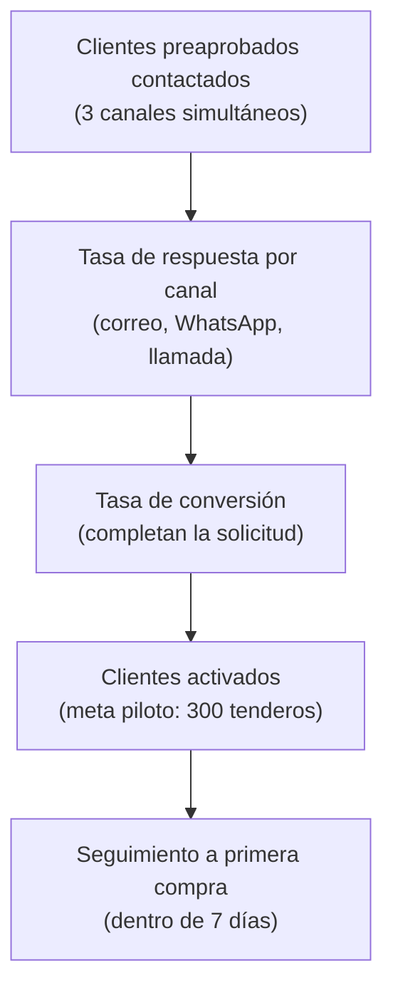

# 1. Indicadores comerciales y de captación

[← Volver a Indicadores](README.md)

**Horizonte:** MVP (piloto)

## Embudo de captación

## Indicadores

- Tasa de respuesta por canal (correo, WhatsApp, llamada): % de clientes preaprobados que responden a cada canal de contacto simultáneo.
- Tasa de conversión: % de clientes contactados que completan la solicitud de crédito.
- Canal más efectivo y tipo de negocio: análisis por segmento para priorizar canales y perfiles de cliente.
- Clientes contactados y activados en el piloto (meta inicial de referencia: primeros 300 tenderos).
- Seguimiento a primera compra: % de clientes aprobados contactados dentro de los 7 días si no han usado el cupo.

## Fuentes consultadas

- Modelo Comercial B2B — *Modelo Comercial B2B.pptx*
- Alcance del Producto (`producto/alcance.md`)
