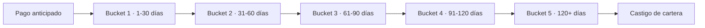

# 3. Indicadores de cartera y cobranza

[← Volver a Indicadores](README.md)

**Horizonte:** Evolución

## Qué se mide en cada bucket

En cada bucket se hace seguimiento a: % de cartera en ese bucket (monto y volumen), tasa de recuperación, cumplimiento de acuerdos de pago y % de casos escalados al siguiente bucket.

## Indicadores

- Distribución de la cartera por bucket de mora (pago anticipado, bucket 1 a 5), en porcentaje y en monto.
- Tasa de mora y cartera en riesgo (PAR).
- Tasa de recuperación por bucket y por tipo de alivio otorgado (abono parcial, congelamiento de intereses, condonación).
- % de clientes reportados negativamente a centrales de riesgo.
- % de casos escalados a proceso jurídico y tasa de recuperación en esa etapa.
- % de castigo de cartera.
- Cumplimiento de compromisos y acuerdos de pago (promesas cumplidas vs. incumplidas).
- Casos priorizados por el Comité de Cartera y motivo de priorización (días de mora, cuotas vencidas, monto adeudado).

## Fuentes consultadas

- Modelo y Proceso de Cobranza B2B — *Modelo Cobranza/Modelo_de_Cobranza_B2B_.pptx* y *Modelo Cobranza/Modelo y gestion de cobranza.docx*
- Reglas Negocio (`negocio/reglas-negocio.md`)
- Procesos — [09. Gestión de cobranza por bucket de mora](../procesos/09-cobranza.md)
