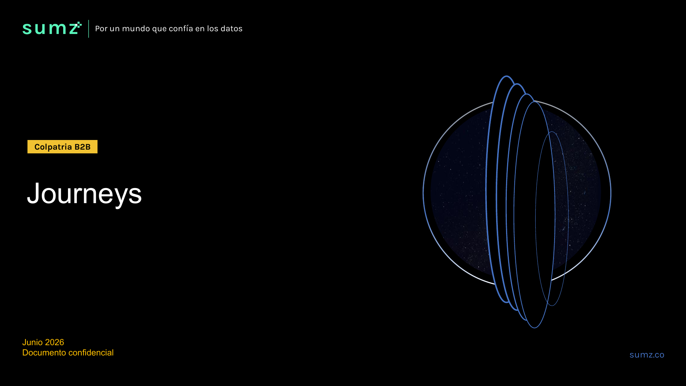

# Procesos

| Documento | Procesos |
|-----------|----------|
| **Proyecto** | Fliipa |
| **Versión** | 1.2 |
| **Estado** | Borrador para validación |
| **Responsable** | Negocio y operaciones |
| **Última actualización** | 2026-07-09 |

---

## Control de versiones

| Versión | Fecha | Autor | Descripción |
|---------|-------|-------|-------------|
| 0.1 | 2026-07-06 | Equipo Flipa | Borrador vacío (pendiente de completar). |
| 1.0 | 2026-07-09 | María Fernanda Herazo (con asistencia de Claude) | Primera versión completa del flujo operacional del crédito, construida a partir del Alcance del Producto, los Journeys Colpatria B2B (junio 2026), el Modelo Comercial B2B y el Modelo y Proceso de Cobranza B2B. Pendiente de validación por negocio y operaciones. |
| 1.1 | 2026-07-09 | María Fernanda Herazo (con asistencia de Claude) | Se actualizan las notas de KYC y alivios tras corregir Actores (proveedor de biometría Olimpia, se agrega Zenvia) y Reglas Negocio (se agrega abono parcial). Se mantiene abierta la nota sobre la discrepancia de plazos de escalamiento jurídico. |
| 1.2 | 2026-07-09 | María Fernanda Herazo (con asistencia de Claude) | Se agrega el anexo con las imágenes de las 10 páginas de los Journeys Colpatria B2B (junio 2026), cada una enlazada a su propio archivo. |

---

## Objetivo

Describir el flujo operacional del crédito Fliipa, desde la captación comercial hasta el cierre o la recuperación de la obligación, para que negocio, producto, tecnología y operaciones compartan una misma referencia sobre cómo se ejecuta cada etapa del ciclo de crédito.

## Alcance

Este documento cubre los procesos de negocio de captación comercial, onboarding, validación de identidad, evaluación de riesgo, firma y activación del crédito, dispersión de fondos, uso y pago del crédito, cobranza y escalamiento jurídico, y servicio al cliente. No incluye el detalle de las reglas específicas que rigen cada proceso (ver [Reglas Negocio](reglas-negocio.md)) ni las especificaciones técnicas de cada integración (ver [Técnico](../tecnico/README.md)).

## Documentos relacionados

- [Negocio](README.md)
- [Flipa - Biblioteca de Conocimiento](../README.md)
- [Mapa Del Conocimiento](../MAPA_DEL_CONOCIMIENTO.md)
- [Onboarding](../ONBOARDING.md)
- [Convenciones](../CONVENCIONES.md)
- [Producto](../producto/README.md)
- [Funcional](../funcional/README.md)
- [Qa](../qa/README.md)
- [Descripcion Negocio](descripcion-negocio.md)
- [Actores](actores.md)
- [Indicadores](indicadores.md)
- [Reglas Negocio](reglas-negocio.md)

## Contenido

### 1. Captación comercial

El contacto inicial se hace de forma simultánea por tres canales sobre la base de clientes preaprobados de D1: correo (tono informativo, informa el cupo y el link de solicitud), WhatsApp (canal principal, tono cercano) y llamada (speech comercial, tono conversacional). El cliente responde por el canal que prefiera y, una vez muestra interés, la conversación migra a WhatsApp para la originación.

Flujo resumido: base de clientes preaprobados → contacto simultáneo por los 3 canales → el asesor monitorea la respuesta → el cliente interesado responde y recibe el link de solicitud por WhatsApp → completa la solicitud (NIT, datos del negocio y del representante legal) → el asesor resuelve dudas y acompaña el proceso → continúa a KYC y evaluación de riesgo → si es aprobado, el asesor notifica al cliente dentro de las 72 horas siguientes a la validación → firma del contrato → cupo activo en D1 → si el cliente no ha usado el cupo en 7 días, el asesor hace seguimiento de primera compra.

Hoja de ruta de activación (fase piloto): validar la base de clientes preaprobados con D1, activar plantillas de WhatsApp/correo/speech, lanzar el piloto contactando a los primeros 300 tenderos y medir la tasa de respuesta por canal, acompañar la originación con un hunter que visita los negocios seleccionados, dar seguimiento a la primera compra, y analizar métricas para escalar (canal más efectivo, tipo de negocio, tasa de conversión y de uso).

### 2. Onboarding digital

El cliente recibe un link único de invitación por correo, SMS o WhatsApp (a través de Sendgrid y Zenvia), lo abre e ingresa su NIT o cédula de ciudadanía, ingresa su ubicación (ciudad y dirección) y su correo. El sistema valida esta información contra la base de datos de Flipa e identifica el cupo preaprobado, calculado a partir de criterios preliminares de consumo en D1. El cliente valida su número de teléfono mediante un código OTP (puede reenviarse si no llega), acepta los términos y condiciones, y proporciona la información personal del representante legal. Todo el proceso toma aproximadamente 3 minutos.

### 3. Validación de identidad (KYC)

El cliente crea un PIN de seguridad de cuatro dígitos, realiza la verificación biométrica con el proveedor externo Olimpia (fuera de la aplicación) y adjunta la certificación bancaria y los extractos de los últimos 3 meses. También vincula su cuenta bancaria (el sistema la valida contra Druo) y selecciona la localidad habitual de compra.

El resultado de la biometría puede ser:

- **Exitoso**: continúa a evaluación de riesgo.
- **En revisión**: un analista de riesgo resuelve el caso manualmente; el cliente recibe un mensaje de que debe esperar respuesta en los próximos dos días.
- **Rechazado**: el proceso termina y se notifica al cliente.

### 4. Evaluación de riesgo

El sistema consulta Experian y el histórico transaccional de D1, valida la cuenta bancaria contra los productos reportados en Experian, y evalúa automáticamente el score mínimo, la capacidad de endeudamiento y si la tienda habitual declarada coincide con la registrada en el histórico de D1. Si el cliente cumple los requisitos, se aprueba o ajusta el cupo y continúa a firma de contrato. Si no cumple, se rechaza el crédito, se emite una alarma y se notifica el rechazo al cliente por correo.

### 5. Firma de contrato y activación

El cliente ingresa su NIT y su PIN de seguridad, revisa el contrato y el pagaré (cupo aprobado, plan de pagos, valor a pagar, fecha de pago y tasa de interés) y acepta las condiciones. Recibe un código de verificación al correo para confirmar la firma; con eso se generan el contrato y el pagaré firmados, se envía copia al cliente y se le asigna el bono de D1. El crédito queda aprobado y el cliente puede continuar al uso del bono.

### 6. Dispersión de fondos

Los fondos se administran mediante una fiducia constituida por el aliado de core bancario (Colpatria), que concentra el origen y el retorno del dinero del crédito. Cuando el sistema detecta (mediante un worker periódico) que el cliente usó su bono en una compra en D1, la fiducia recibe el desembolso y emite el bono por el valor del cupo utilizado; el pago posterior del cliente retorna a la fiducia, no directamente a D1. El giro de la fiducia hacia D1 genera un GMF (4x1000) de $4.000 por cada ciclo de $1.000.000 (0,4%); en 12 ciclos anuales sobre el mismo capital, equivale a un costo del 4,8% anual. Si la fiducia se constituye en el mismo banco donde ya están los fondos, se ahorra el 4x1000 del fondeo inicial. El cupo remanente se bloquea automáticamente tras el primer uso, para evitar compras adicionales dentro del mismo ciclo.

### 7. Uso y renovación del cupo

El cliente usa el bono en tiendas D1. Al pagar el crédito se evalúa la renovación del cupo según su comportamiento de pago y la disponibilidad de cupo: si el comportamiento es bueno, se otorga un nuevo cupo; si es malo o la disponibilidad es baja, el proceso termina sin renovación.

### 8. Cobro y pago del crédito

El sistema genera el plan de pagos (cuotas, fechas, tasa) desde el inicio del crédito. El cliente puede prepagar mediante PSE desde la plataforma web o esperar el cobro automático de Druo al cierre del ciclo. Cada pago se registra, aplica a la amortización y actualiza el saldo. Al liquidar el crédito se libera el cupo. Si el crédito no se paga al corte, el caso deriva al flujo de cobranza.

### 9. Gestión de cobranza por bucket de mora

La cartera se segmenta en seis estados: pago anticipado (antes del vencimiento), bucket 1 (1-30 días), bucket 2 (31-60 días), bucket 3 (61-90 días), bucket 4 (91-120 días) y bucket 5 (120+ días). La gestión de cartera se mantiene activa en todos los segmentos mediante llamadas, correos y WhatsApp, y la cobranza inicia desde la originación del crédito, no desde la mora.

- **Pago anticipado**: visita de originación (formaliza la apertura de la línea de crédito) y mensajes de bienvenida por WhatsApp (día -5, -3, -1 y día 0); visita de confirmación y verificación el día 25, antes del pago máximo (auditoría de datos de contacto, medios de pago e inventario del negocio).
- **Bucket 1 (1-30 días)**: llamada directa con guion estandarizado, WhatsApp informativo y luego con advertencia de consecuencias, preaviso formal de reporte negativo el día 15 en mora, y priorización de visita de cobro y gestión especial según el Comité de Cartera.
- **Bucket 2 (31-60 días)**: llamada directa para negociar y dar seguimiento a compromisos, comunicaciones estructuradas por WhatsApp y correo, y aviso formal de reporte negativo el día 30 en mora.
- **Bucket 3 (61-90 días)**: email de preaviso del proceso jurídico, notificando la acción legal inminente si no se normaliza la obligación.
- **Bucket 4 (91-120 días)**: aviso formal de inicio de proceso jurídico (email y carta física) y comunicación directa del analista jurídico o abogado, buscando negociar antes de proceder judicialmente.
- **Bucket 5 (120+ días)**: definición de cuantía y juzgado competente, radicación de la demanda, verificación de datos de notificación del deudor, y un canal de negociación que solo se abre dentro del proceso legal, con acuerdos formales condicionados a pago inicial y compromiso documentado. Si se llega a un acuerdo, se retira la demanda y se actualiza el reporte en centrales de riesgo.

El **Comité de Cartera** se reúne semanalmente y prioriza casos según días de mora (con foco en 20+ días), flujo de caja y tipo de negocio, número de cuotas vencidas, historial y respuesta del cliente, y monto adeudado alto.

> **Nota de inconsistencia (pendiente de validar):** el journey de Colpatria B2B (junio 2026) describe un flujo de cobranza más corto: día 0 activa débito automático, día 1-5 reintento, día 6-15 WhatsApp/SMS con preaviso de reporte a centrales en 15 días, día 16-30 llamada para confirmar causa de no pago y, si el cliente no acepta pagar o no cumple, reporte a centrales (día 15/45 de mora) y **bloqueo permanente del cupo con inicio de cobro jurídico desde el día 30 de mora**. Esto es distinto al esquema de buckets (escalamiento jurídico entre bucket 3 y bucket 5, es decir 61 a 120+ días) documentado en el Modelo y Proceso de Cobranza B2B. Ambos flujos quedan documentados hasta que negocio y operaciones confirmen cuál está vigente (la misma nota aplica en [Reglas Negocio](reglas-negocio.md)).

### 10. Alivios y negociación

Durante la gestión de mora se pueden ofrecer tres tipos de alivio: abono parcial, congelamiento de intereses y condonación. El detalle de condiciones de cada uno está en [Reglas Negocio](reglas-negocio.md).

### 11. Servicio al cliente

El cliente contacta por WhatsApp, correo o llamada (también puede ser un contacto outbound). Un asistente virtual basado en IA recibe el caso, lo clasifica e intenta resolverlo en el primer contacto. Si la IA resuelve el caso, comunica la solución al cliente y lo cierra en el portal administrativo. Si no puede resolverlo, escala a un agente humano con el contexto completo de la conversación; los casos críticos (suplantación, uso indebido del cupo, desconocimiento de una compra) requieren validación de identidad y aprobación manual explícita del agente. Los casos legales o de PQR se enrutan al área legal con SLA de respuesta inmediata. Todo caso se registra en el portal administrativo y se mide mediante NPS/CSAT al cierre.

### 12. Gobernanza operativa transversal

El Comité de Cartera semanal (con participación, entre otros, de un Senior Credit Strategy Analyst y un Account and Portfolio Specialist / Product Manager) es la instancia que prioriza la gestión de cobro. Los indicadores de comercial y cobranza se comparten entre ambas áreas, y se mantienen tableros semanales y alertas automáticas para el seguimiento de la cartera.

## Anexo: Journeys Colpatria B2B (junio 2026)

Imágenes de las 10 páginas del documento fuente (*Journeys Fran finales-1.pdf*). Cada imagen enlaza a su propio archivo en alta resolución para verla en detalle.

*Página 1 — Portada.*

*Página 2 — Onboarding, parte 1 (secciones 2 y 3 de este documento).*

*Página 3 — Onboarding, parte 2 y validación de identidad (sección 3).*

*Página 4 — Evaluación de riesgo (sección 4).*

*Página 5 — Firma de contrato, parte 1 (sección 5).*

*Página 6 — Firma de contrato, parte 2 y activación (sección 5).*

*Página 7 — Cobro y pago del crédito (sección 8).*

*Página 8 — Dispersión de fondos (sección 6).*

*Página 9 — Servicio al cliente (sección 11).*

*Página 10 — Gestión de cobranza (sección 9); ver nota de inconsistencia con el esquema de buckets.*

## Fuentes consultadas

- Alcance del Producto [Alcance](../producto/alcance.md)
- Journeys Colpatria B2B, junio 2026 — *Journeys Fran finales-1.pdf*
- Modelo Comercial B2B — *Modelo Comercial B2B.pptx*
- Modelo y Proceso de Cobranza B2B — *Modelo Cobranza/Modelo_de_Cobranza_B2B_.pptx* y *Modelo Cobranza/Modelo y gestion de cobranza.docx*
- Investigación B2B — *Modelo Cobranza/Investigacion B2B.docx*
- Reglas Negocio [Negocio](../negocio/regla-negocio.md)
