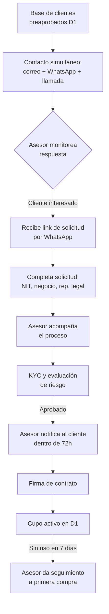

# 1. Captación comercial

[← Volver a Procesos](README.md)

## Objetivo

Iniciar la oportunidad de crédito Fliipa a partir de una base de clientes preaprobados de D1 y convertir esa interacción inicial en una solicitud válida de originación.

## Descripción general

El proceso comienza cuando D1 aporta una base de clientes preaprobados y el equipo comercial activa un contacto simultáneo por correo, WhatsApp y llamada. La intención es generar interés, recibir la respuesta del cliente y canalizarlo hacia la solicitud inicial con el apoyo del asesor. Si el cliente muestra interés, el asesor comparte el link de solicitud y acompaña el recorrido hasta que la oportunidad avanza a KYC, evaluación de riesgo y firma de contrato. Si no responde o no completa la solicitud, la oportunidad queda pendiente de seguimiento o se descarta según el criterio comercial.

### Canales de contacto inicial

| Canal | Tono | Contenido |
|-------|------|-----------|
| Correo | Informativo | Informa el cupo preaprobado y el link de solicitud |
| WhatsApp | Cercano | Canal principal; la conversación migra aquí para la originación |
| Llamada | Conversacional | Speech comercial |

## Actores involucrados

- Cliente empresarial: responde al contacto inicial y completa la solicitud cuando está interesado.
- Asesor comercial: inicia el contacto, acompaña al cliente y da seguimiento a la oportunidad.
- D1: aporta la base de clientes preaprobados sobre la cual se activa la captación.
- Sistema de comunicaciones y web de solicitud: soporta el envío de los mensajes iniciales y la captura de la solicitud.

## Flujo del proceso

## Referencia visual del journey

- Página 1 del journey Colpatria B2B (junio 2026): contexto general del recorrido del crédito y la captación comercial.
- Fuente visual de respaldo para validar la secuencia documentada en este proceso.

## Explicación paso a paso

1. Base de clientes preaprobados de D1
   - Qué sucede: se toma la base de clientes elegibles para recibir una propuesta de crédito.
   - Qué actor interviene: D1.
   - Qué sistema participa: fuente de datos comercial de D1.
   - Qué información se utiliza: clientes preaprobados, historial comercial y segmentación de negocio.
   - Qué decisión se toma: se define si el cliente entra al piloto o al proceso de captación.
   - Qué ocurre si el resultado es positivo: se activa el contacto inicial.
   - Qué ocurre si el resultado es negativo: la oportunidad no se inicia.

2. Contacto simultáneo por correo, WhatsApp y llamada
   - Qué sucede: se lanza la interacción inicial sobre la base seleccionada.
   - Qué actor interviene: asesor comercial.
   - Qué sistema participa: canales de comunicación y plantillas de mensaje.
   - Qué información se utiliza: cupo preaprobado y link de solicitud.
   - Qué decisión se toma: se prioriza el canal más efectivo para captar respuesta.
   - Qué ocurre si el resultado es positivo: el cliente responde y entra al flujo de solicitud.
   - Qué ocurre si el resultado es negativo: el cliente no responde y la oportunidad queda abierta a seguimiento.

3. Monitoreo de respuesta
   - Qué sucede: el asesor supervisa si el cliente muestra interés.
   - Qué actor interviene: asesor comercial.
   - Qué sistema participa: canal de comunicación y registro de interacción.
   - Qué información se utiliza: respuesta del cliente, canal elegido y nivel de interés.
   - Qué decisión se toma: si el cliente está dispuesto a continuar.
   - Qué ocurre si el resultado es positivo: se comparte el link de solicitud.
   - Qué ocurre si el resultado es negativo: se deja pendiente o se descarta la oportunidad.

4. Recepción del link de solicitud
   - Qué sucede: el cliente ingresa al proceso de solicitud desde el canal que prefirió.
   - Qué actor interviene: cliente empresarial.
   - Qué sistema participa: web de solicitud.
   - Qué información se utiliza: cupo preaprobado, datos de negocio y enlace único.
   - Qué decisión se toma: se decide si el cliente continúa con la captura de datos.
   - Qué ocurre si el resultado es positivo: el cliente completa la solicitud.
   - Qué ocurre si el resultado es negativo: la solicitud no se inicia o queda incompleta.

5. Completar la solicitud inicial
   - Qué sucede: el cliente registra información básica de la solicitud.
   - Qué actor interviene: cliente empresarial y asesor comercial.
   - Qué sistema participa: web de solicitud.
   - Qué información se utiliza: NIT, negocio y representante legal.
   - Qué decisión se toma: si la información mínima está completa para avanzar.
   - Qué ocurre si el resultado es positivo: se pasa a acompañamiento y validación posterior.
   - Qué ocurre si el resultado es negativo: se solicita completar la información faltante.

6. Acompañamiento del asesor
   - Qué sucede: el asesor apoya el avance del cliente durante la originación.
   - Qué actor interviene: asesor comercial.
   - Qué sistema participa: canal de comunicación y CRM de seguimiento.
   - Qué información se utiliza: estado de la solicitud y datos del cliente.
   - Qué decisión se toma: si el caso sigue viable para avanzar a KYC y riesgo.
   - Qué ocurre si el resultado es positivo: la oportunidad sigue al siguiente proceso.
   - Qué ocurre si el resultado es negativo: se detiene o se reprograma el seguimiento.

7. KYC y evaluación de riesgo
   - Qué sucede: el caso avanza a la validación de identidad y riesgo.
   - Qué actor interviene: sistema y equipo de riesgo.
   - Qué sistema participa: flujo de validación de identidad y evaluación.
   - Qué información se utiliza: datos de la solicitud y el contexto del cliente.
   - Qué decisión se toma: si el cliente es aprobado para continuar.
   - Qué ocurre si el resultado es positivo: se notifica la aprobación dentro de 72 horas.
   - Qué ocurre si el resultado es negativo: el proceso de originación se rechaza o detiene.

8. Notificación de aprobación
   - Qué sucede: se comunica al cliente el resultado de la evaluación.
   - Qué actor interviene: asesor comercial.
   - Qué sistema participa: canal de notificación.
   - Qué información se utiliza: resultado del análisis de riesgo y estado del caso.
   - Qué decisión se toma: si se continúa a firma de contrato.
   - Qué ocurre si el resultado es positivo: el cliente avanza a firma.
   - Qué ocurre si el resultado es negativo: se notifica el rechazo.

9. Firma de contrato
   - Qué sucede: se continúa con la activación del crédito formal.
   - Qué actor interviene: cliente empresarial y asesor comercial.
   - Qué sistema participa: proceso de firma y activación.
   - Qué información se utiliza: resultado de aprobación y condiciones del crédito.
   - Qué decisión se toma: si se avanza a activación del cupo.
   - Qué ocurre si el resultado es positivo: se activa el cupo en D1.
   - Qué ocurre si el resultado es negativo: la etapa queda bloqueada o se cancela.

10. Cupo activo en D1
   - Qué sucede: el crédito queda operativo y disponible para uso.
   - Qué actor interviene: cliente empresarial y D1.
   - Qué sistema participa: plataforma de crédito y canal de uso del cupo.
   - Qué información se utiliza: cupo aprobado y estado de activación.
   - Qué decisión se toma: si se requiere seguimiento adicional.
   - Qué ocurre si el resultado es positivo: se mantiene la relación comercial.
   - Qué ocurre si el resultado es negativo: se detecta baja activación o abandono.

11. Seguimiento a primera compra
   - Qué sucede: el asesor revisa si el cliente usó el cupo dentro de los primeros 7 días.
   - Qué actor interviene: asesor comercial.
   - Qué sistema participa: seguimiento comercial y reportes de activación.
   - Qué información se utiliza: uso del cupo y fecha de activación.
   - Qué decisión se toma: si se necesita acción comercial adicional.
   - Qué ocurre si el resultado es positivo: se consolida la primera compra.
   - Qué ocurre si el resultado es negativo: se dispara seguimiento comercial o reactivación.

## Reglas de negocio

- El contacto inicial debe hacerse de forma simultánea por correo, WhatsApp y llamada.
- El canal principal de continuidad es WhatsApp.
- El cliente puede responder por el canal que prefiera.
- El asesor acompaña la solicitud hasta avanzar a validación y riesgo.
- El resultado esperado es una notificación de aprobación dentro de 72 horas.

## Entradas

- Base de clientes preaprobados de D1.
- Cupo preaprobado asociado al cliente.
- Información mínima de la solicitud: NIT, negocio y representante legal.
- Plantillas de contacto y speech comercial.

## Salidas

- Oportunidad de crédito registrada y enviada a la etapa de originación.
- Solicitud inicial completa para continuar con KYC, evaluación de riesgo y firma.
- Cliente activado hacia el siguiente paso del proceso de crédito.

## Excepciones

- El cliente no responde a los canales iniciales.
- La solicitud queda incompleta o con datos insuficientes.
- El cliente no muestra interés en continuar.
- El caso no avanza por datos incompletos o rechazo en riesgo.
- Se detecta una oportunidad de seguimiento posterior en vez de cierre inmediato.

## Consideraciones

- El proceso forma parte de la fase piloto inicial del producto.
- El documento contempla un piloto con los primeros 300 tenderos.
- La métrica de éxito del proceso incluye tasa de respuesta por canal, conversión y uso del cupo.
- La ruta de activación se conecta con los procesos de KYC, riesgo, contrato y uso del cupo.

## Pendientes de validación

> **Pendiente de validar con el dueño del proceso.** El seguimiento a primera compra y la definición precisa del canal más efectivo para la captación aún requieren medición en el piloto.
