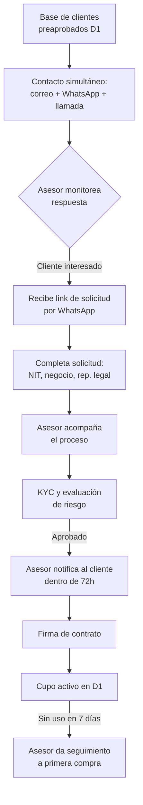

# 1. Captación comercial

[← Volver a Procesos](README.md)

## Canales de contacto inicial

| Canal | Tono | Contenido |
|-------|------|-----------|
| Correo | Informativo | Informa el cupo preaprobado y el link de solicitud |
| WhatsApp | Cercano | Canal principal; la conversación migra aquí para la originación |
| Llamada | Conversacional | Speech comercial |

El contacto se hace de forma **simultánea** por los tres canales sobre la base de clientes preaprobados de D1. El cliente responde por el canal que prefiera.

## Flujo

## Hoja de ruta de activación (fase piloto)

| Paso | Acción |
|------|--------|
| 1 | Validar la base de clientes preaprobados con D1 |
| 2 | Activar plantillas de WhatsApp, correo y speech |
| 3 | Lanzar el piloto con los primeros 300 tenderos y medir tasa de respuesta por canal |
| 4 | Acompañar la originación con un hunter que visita los negocios seleccionados |
| 5 | Dar seguimiento a la primera compra |
| 6 | Analizar métricas para escalar (canal más efectivo, tipo de negocio, conversión, uso) |
