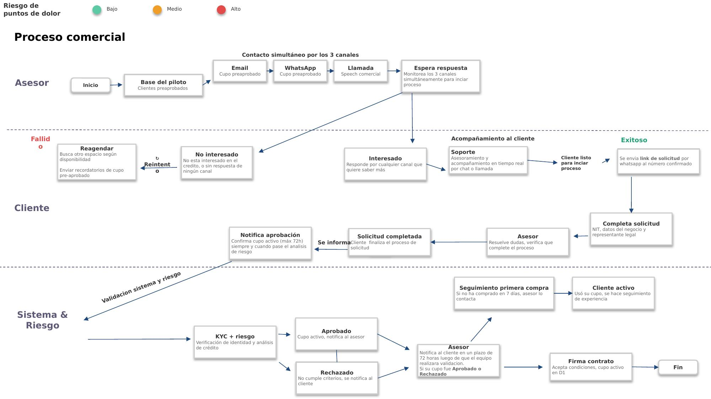

# 1. Captación comercial

## Objetivo

Contactar a los clientes preaprobados de la base del piloto (tenderos socios D1) a través de tres canales simultáneos (email, WhatsApp y llamada), generar su interés en el crédito rotativo, acompañarlos hasta que completen la solicitud digital y hacer seguimiento posterior a la aprobación —firma de contrato y primer uso del cupo— para asegurar la activación efectiva del cliente.

---

## Contexto del producto

El proceso de captación comercial es la puerta de entrada al ecosistema del crédito B2B **Socios D1**, que conecta tres actores:

- **D1**: la cadena de descuento, con más de 3.000 tiendas y millones de clientes tenderos que compran semanalmente.
- **Sumz / Fliipa**: la plataforma financiera que origina y gestiona el crédito rotativo B2B, evaluando con datos de consumo real (no solo historial bancario).
- **El tendero**: pequeño comercio con alta frecuencia de compra en D1, que necesita flujo de caja flexible para surtir su negocio sin descapitalizarse.

El producto es un **cupo rotativo preaprobado** para comprar en D1 y pagar en 3 cuotas, con aprobación máxima en 72 horas. El cliente paga, libera cupo y puede volver a usarlo; el cupo se bloquea ante retrasos de pago y se reporta a centrales de riesgo según los plazos legales.

---

## Journey

**Figura 1. Journey de Captación Comercial** (fuente: *Modelo Comercial B2B.pptx*, diapositiva 10).

El journey se organiza en tres carriles (swimlanes): **Asesor**, **Cliente** y **Sistema & Riesgo**. Incluye una escala de "riesgo de puntos de dolor" (Bajo/Medio/Alto) en la leyenda, aunque el diagrama fuente no marca explícitamente cada caja con un color de esta escala; queda pendiente confirmar si esa clasificación aplica a pasos específicos.

---

## Descripción general

El proceso inicia con la base de clientes preaprobados definida para el piloto. El asesor contacta a cada cliente de forma **simultánea** por tres canales —email, WhatsApp y llamada— y el sistema monitorea los tres a la espera de una respuesta. Si el cliente no responde o manifiesta desinterés, el caso se reagenda y se reintenta el contacto enviando recordatorios del cupo preaprobado.

Cuando el cliente responde por cualquiera de los canales mostrando interés, el asesor lo acompaña en tiempo real (chat o llamada) hasta dejarlo listo para iniciar el proceso, momento en el cual se le envía el enlace de solicitud por WhatsApp al número confirmado. El cliente completa la solicitud (NIT, datos del negocio y del representante legal) mientras el asesor verifica que el proceso se complete correctamente.

Una vez finalizada la solicitud, el caso pasa a **Sistema & Riesgo** para la verificación de identidad y el análisis de crédito (KYC + riesgo). El asesor notifica al cliente, en un plazo de hasta 72 horas, si su cupo fue aprobado o rechazado. Los casos aprobados continúan hacia la firma del contrato y la activación del cupo en D1; posteriormente, si el cliente no ha realizado su primera compra en 7 días, el asesor hace un seguimiento adicional para impulsar el uso del cupo.

---

## Explicación paso a paso

### 1. Base del piloto

**Actor:** Asesor.

**Información utilizada:** Lista de clientes preaprobados (tenderos socios D1) y sus datos de contacto.

**Proceso:** El asesor parte de la base de clientes preaprobados definida para el piloto, la cual contiene los datos de contacto (teléfono, correo) de los tenderos seleccionados según su comportamiento de compra en D1.

**Resultado:** Base de clientes preaprobados lista para iniciar el contacto comercial.

---

### 2. Contacto simultáneo por los 3 canales

**Actor:** Asesor / Sistema.

**Sistemas involucrados:** Email, WhatsApp, llamada telefónica.

**Información utilizada:** Cupo preaprobado del cliente; speech comercial.

**Proceso:** Se contacta al cliente por los tres canales al mismo tiempo, con un mensaje coherente pero adaptado al tono de cada canal:

- **Email:** primer contacto formal. Informa el cupo preaprobado y el link de solicitud. Tono informativo.
- **WhatsApp:** canal principal. Envío de enlace, seguimiento y soporte en tiempo real. Tono cercano y directo.
- **Llamada:** speech comercial — presentación del beneficio, manejo de objeciones y cierre. Tono conversacional.

**Resultado:** Cliente contactado por los tres canales; el sistema monitorea simultáneamente las tres vías para iniciar el proceso apenas el cliente responda por cualquiera de ellas.

**Placeholder\*:** no está definida la plataforma técnica exacta usada para el envío de email y WhatsApp en esta etapa (posiblemente Sendgrid/Zenvia, igual que en el onboarding, a confirmar), ni el orden o los tiempos de espaciamiento entre canales.

---

### 3. Espera de respuesta

**Actor:** Sistema (monitoreo) / Asesor.

**Proceso:** El sistema monitorea los tres canales de forma simultánea a la espera de que el cliente responda por cualquiera de ellos.

**Decisión:** ¿El cliente responde y muestra interés?

- **No / sin respuesta:** el caso pasa a gestión de "No interesado".
- **Sí:** el caso pasa a atención y acompañamiento por el asesor.

---

### 4. Gestión de "No interesado" y reagendamiento

**Actor:** Asesor.

**Proceso:** Si el cliente indica que no está interesado en el crédito, o si no responde por ningún canal, el caso se marca como "No interesado". El asesor busca otro espacio de contacto según disponibilidad (reagendar) y envía recordatorios del cupo preaprobado. El caso reingresa al flujo de contacto (reintento) por los mismos tres canales.

**Resultado:** Nuevo intento de contacto programado.

**Placeholder\*:** no está definido el número máximo de reintentos ni el tiempo de espera entre cada uno antes de cerrar definitivamente el caso.

---

### 5. Cliente interesado

**Actor:** Cliente.

**Proceso:** El cliente responde por cualquiera de los tres canales manifestando interés en conocer más sobre el crédito.

**Resultado:** El caso pasa a acompañamiento por parte del asesor (soporte).

---

### 6. Soporte y acompañamiento

**Actor:** Asesor.

**Proceso:** El asesor brinda asesoramiento y acompañamiento en tiempo real, por chat o llamada, resolviendo dudas sobre el producto y guiando al cliente hacia el inicio del proceso.

**Resultado:** Cliente listo para iniciar el proceso de solicitud.

---

### 7. Envío del link de solicitud

**Actor:** Sistema (disparado por el asesor).

**Información utilizada:** Número de teléfono confirmado durante el contacto.

**Proceso:** Se envía el link de solicitud por WhatsApp al número de teléfono confirmado durante la llamada o conversación previa.

**Resultado:** Cliente listo para iniciar el proceso digital.

> **Nota de continuidad:** este paso conecta con el **paso 1 del journey de Onboarding digital** (documento 2), donde el cliente recibe el enlace a la landing page.

---

### 8. Cliente completa la solicitud

**Actor:** Cliente.

**Información utilizada:** NIT, datos del negocio y del representante legal.

**Proceso:** El cliente diligencia el formulario de solicitud con el NIT, los datos del negocio y del representante legal.

**Resultado:** Solicitud diligenciada, pendiente de verificación.

> **Nota de continuidad:** este paso se desarrolla en detalle en el journey de **Onboarding digital** (documento 2).

---

### 9. Verificación y acompañamiento del asesor

**Actor:** Asesor.

**Proceso:** El asesor resuelve dudas adicionales del cliente y verifica que complete correctamente todo el proceso de solicitud.

**Resultado:** Solicitud completada — el cliente finaliza el proceso.

---

### 10. Validación de sistema y riesgo (KYC + riesgo)

**Actor:** Sistema & Riesgo.

**Proceso:** Una vez completada la solicitud, esta pasa a verificación de identidad y análisis de crédito.

**Decisión:** ¿El cliente es aprobado?

- **Aprobado:** cupo activo, se notifica al asesor.
- **Rechazado:** no cumple los criterios, se notifica al cliente.

> **Nota de continuidad:** este paso corresponde al journey de **Validación de Identidad — KYC** (documento 3).

---

### 11. Notificación de aprobación o rechazo

**Actor:** Asesor.

**Proceso:** El asesor notifica al cliente, en un plazo de hasta 72 horas después de que el equipo realice la validación, si su cupo fue aprobado o rechazado. En caso de aprobación, se confirma el cupo activo (máximo 72 h), siempre que haya pasado el análisis de riesgo.

**Resultado:** Cliente informado sobre el resultado de su solicitud.

**Placeholder\*:** en el diagrama, tanto el camino "Aprobado" como el camino "Rechazado" convergen hacia esta misma caja de notificación del asesor, y de ahí el flujo continúa hacia "Firma de contrato". No queda claro si el cliente rechazado también pasa por esa notificación conjunta o si el flujo debería bifurcarse antes de la firma del contrato (un cliente rechazado no debería llegar a esa etapa). **Pendiente de confirmar con el dueño del proceso.**

---

### 12. Firma de contrato

**Actor:** Cliente.

**Proceso:** El cliente acepta las condiciones del crédito y el cupo queda activo en D1.

**Resultado:** Cupo activo en D1.

> **Nota de continuidad:** este paso se desarrolla en detalle en el journey de **Firma de Contrato y Activación** (documento 4).

---

### 13. Seguimiento a la primera compra

**Actor:** Asesor.

**Proceso:** Si el cliente no ha realizado una compra dentro de los 7 días posteriores a la activación del cupo, el asesor lo contacta nuevamente para impulsar el primer uso.

**Resultado:** Cliente contactado con recordatorio de uso del cupo.

---

### 14. Cliente activo

**Actor:** Cliente.

**Proceso:** Una vez el cliente usa su cupo por primera vez, se inicia el seguimiento de su experiencia.

**Resultado:** Cliente activo, con seguimiento de experiencia iniciado. Con esto finaliza el proceso de captación comercial.

---

## Reglas de negocio

- El contacto inicial se realiza de forma **simultánea** por los tres canales (email, WhatsApp, llamada), no de forma secuencial.
- El mensaje de email y WhatsApp informa el cupo preaprobado; la llamada usa un speech comercial completo con manejo de objeciones.
- Una vez el cliente muestra interés, toda la interacción migra a WhatsApp para continuar con la originación.
- Si el cliente no responde o no está interesado, el caso se reagenda y se reintenta el contacto con recordatorios del cupo preaprobado.
- El link de solicitud se envía únicamente al número de WhatsApp confirmado durante el contacto.
- El asesor debe verificar que el cliente complete correctamente el proceso de solicitud.
- La notificación de aprobación o rechazo debe entregarse en un plazo máximo de 72 horas después de la validación de KYC + riesgo.
- El cupo confirmado tiene una vigencia máxima de 72 horas, sujeta a que el análisis de riesgo sea satisfactorio.
- Si el cliente aprobado no realiza su primera compra en 7 días, el asesor debe contactarlo nuevamente.

---

## Entradas

- Base de clientes preaprobados del piloto (con datos de contacto).
- Cupo preaprobado por cliente.
- Speech comercial (llamada) y plantillas de mensaje (email, WhatsApp).
- Número de teléfono confirmado.
- NIT, datos del negocio y del representante legal (capturados en la solicitud).
- Resultado de la validación de KYC + riesgo.

---

## Salidas

- Cliente contactado por los tres canales.
- Caso clasificado como "interesado" o "no interesado".
- Link de solicitud enviado.
- Solicitud completada.
- Cliente notificado de aprobación o rechazo.
- Contrato firmado y cupo activo en D1 (para aprobados).
- Seguimiento de primera compra y de experiencia del cliente activo.

---

## Excepciones

- El cliente no responde por ningún canal.
- El cliente indica explícitamente que no está interesado.
- El cliente no completa la solicitud después de mostrar interés.
- La solicitud es rechazada en la validación de KYC + riesgo.
- El cliente aprobado no firma el contrato.
- El cliente no realiza su primera compra dentro de los 7 días posteriores a la activación.

---

## Consideraciones

- El proceso combina gestión humana (asesor) con monitoreo automatizado de canales (sistema).
- El tono de comunicación varía según el canal (informativo en email, cercano en WhatsApp, conversacional en llamada), pero mantiene un mismo mensaje de fondo.
- Según la guía de arquetipos de marca (*Arquetipos.docx*), la comunicación con el tendero se basa en un mix de arquetipos "Persona Corriente + Héroe": un tono cercano, sin tecnicismos, que actúa como aliado del microempresario más que como una entidad financiera tradicional — esto es consistente con los tonos definidos por canal en este journey.
- El proceso de captación es el punto de entrada al resto del ciclo del producto: se conecta directamente con Onboarding digital (documento 2), KYC (documento 3) y Firma de Contrato (documento 4).
- El piloto contempla una hoja de ruta de activación con las siguientes fases (según *Modelo Comercial B2B.pptx*, diapositiva 9): validar la base de datos de clientes preaprobados con D1, activar y configurar los canales (plantillas de WhatsApp, email y speech de llamada con Fliipa), lanzar el piloto contactando un primer lote de tenderos (300, según la referencia inicial) para medir tasa de respuesta por canal, acompañar la originación en sitio cuando aplique, hacer seguimiento a la primera compra, y analizar métricas para escalar (canal más efectivo, tipo de negocio, tasa de conversión y de uso).

---

## Pendientes de validación

> **Pendiente de validar con el dueño del proceso:**
>
> - Confirmar la plataforma técnica usada para el envío simultáneo de email y WhatsApp en esta etapa (¿Sendgrid/Zenvia, como en onboarding, u otra?).
> - Confirmar el número máximo de reintentos de contacto y el tiempo de espera entre cada uno antes de cerrar un caso como "no interesado" definitivo.
> - Confirmar si el flujo de notificación al cliente (paso 11) realmente converge para aprobados y rechazados en la misma caja antes de "Firma de contrato", o si el rechazo debería finalizar el proceso antes de llegar a esa etapa.
> - Confirmar si existe un rol de "Hunter" (mencionado en la hoja de ruta del piloto) para acompañamiento presencial en la originación, y cómo se articula con el rol de Asesor descrito en este journey.
> - Confirmar si la escala de "riesgo de puntos de dolor" (Bajo/Medio/Alto) de la leyenda aplica a pasos específicos de este journey, dado que el diagrama fuente no los marca visualmente.

---

## Fuentes consultadas

- *Modelo Comercial B2B.pptx* (Sumz, junio de 2026), diapositivas 2 a 10 — carpeta *Proceso Collections B2B*.
- *Arquetipos.docx* — guía de identidad de marca y voz para originación, servicio y cobranza.
- Documento de Alcance del Producto.