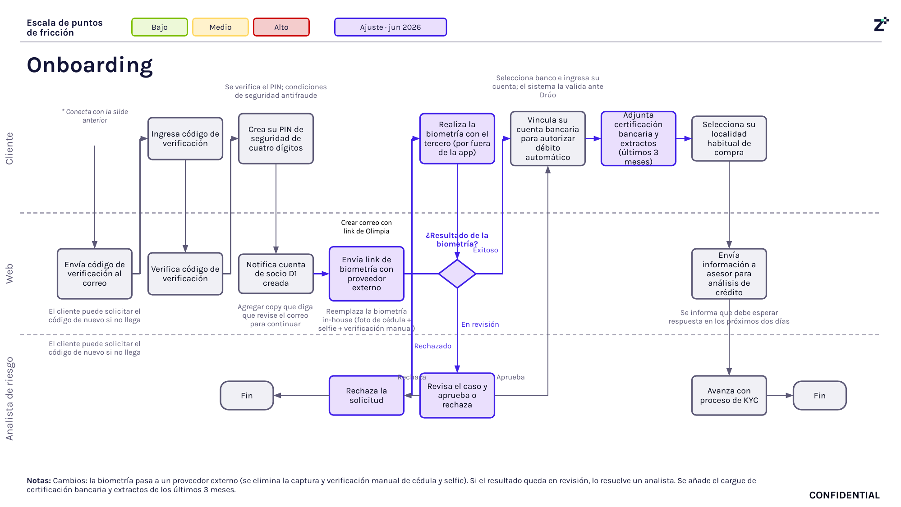

# 2. Onboarding digital

## Objetivo

Registrar al cliente empresarial mediante un proceso completamente digital, identificar su cupo preaprobado utilizando la información transaccional disponible, recopilar la información básica del negocio y del representante legal, validar los mecanismos de autenticación y seguridad, realizar la validación biométrica, registrar la cuenta bancaria para el débito automático y recopilar la documentación necesaria para dejar la solicitud preparada para el análisis crediticio y continuar con el proceso de Validación de Identidad (KYC).

---

## Journey

**Figura 2. Journey de Onboarding Digital (Parte 1).**

**Figura 3. Journey de Onboarding Digital (Parte 2).**

En el journey, las cajas en color morado corresponden a pasos nuevos o ajustados en junio de 2026 (leyenda "Ajuste · jun 2026"); las cajas en gris corresponden a pasos ya existentes del flujo.

---

## Descripción general

El onboarding digital constituye el primer contacto del cliente con el producto y concentra todas las actividades necesarias para crear su perfil dentro de la plataforma.

El proceso inicia cuando el cliente recibe una invitación personalizada por correo electrónico(Sendgrid), SMS o WhatsApp ( Zenvia) para acceder al producto. A partir de este momento registra la información básica del negocio, suministra los datos del representante legal y valida el número telefónico mediante un código OTP. Posteriormente ingresa un segundo código de verificación enviado a su correo electrónico, configura un PIN de seguridad, realiza la validación biométrica con el proveedor externo *Olimpia*, registra la cuenta bancaria desde la cual se autorizarán los débitos automáticos (validada ante Drúo), adjunta la documentación bancaria requerida y selecciona su localidad habitual de compra. Finalmente, toda la información recopilada es enviada al proceso de Validación de Identidad (KYC).

---

## Explicación paso a paso

### 1. Recepción de la invitación

**Actor:** Cliente.

**Sistemas involucrados:** Sendgrid (correo electrónico) y Zenvia (SMS/WhatsApp).

**Información utilizada:** Correo electrónico y/o número de teléfono del cliente.

**Resultado:** El cliente recibe un enlace de invitación por correo, SMS o WhatsApp para iniciar el onboarding de forma segura.

> **Nota técnica (Ajuste · jun 2026):** el journey marca este paso como nuevo/ajustado en la integración de envío con Sendgrid y Zenvia.

---

### 2. Registro del documento de identificación

**Actor:** Cliente.

**Sistemas involucrados:** Plataforma web.

**Información utilizada:** NIT o número de cédula de ciudadanía.

**Resultado:** El sistema identifica el tipo de cliente y recupera la información previamente disponible de las bases de datos.

> **Nota técnica (Ajuste · jun 2026):** el journey señala en este paso la necesidad de cambiar la URL de la página; validar con Tecnología si ya fue implementado.

---

### 3. Identificación del cupo preaprobado

**Actor:** Web (sistema).

**Sistemas involucrados:** Información transaccional de D1.

**Información utilizada:** NIT o cédula registrada; cupo pre-aprobado por colpatria.

**Decisión:** ¿La validaciòn del cupo fue exitosa?

- **Exitoso:** el flujo continúa hacia el registro de ubicación.
- **Fallido:** el cliente vuelve a la pantalla de ingreso del NIT o identificación para intentarlo de nuevo.

**Resultado:** Cupo preaprobado calculado a partir de criterios preliminares de consumo en D1. Esta evaluación corresponde únicamente a una preaprobación y no representa la aprobación definitiva del crédito.

---

### 4. Registro de ubicación

**Actor:** Cliente.

**Información utilizada:** Ciudad o municipio y dirección donde desarrolla su actividad comercial.

**Resultado:** La información queda registrada como parte del perfil inicial del negocio.

---

### 5. Clasificación del tipo de cliente

**Actor:** Sistema.

**Decisión:** ¿Tipo de cliente: NIT o CC?

- **NIT (persona jurídica):** el flujo continúa hacia el reconocimiento del representante legal.
- **CC (persona natural):** el flujo continúa directamente hacia la aceptación de términos y condiciones.

**Resultado:** Según el journey, en el flujo CC esta validación "pasa por detrás", es decir, se verifica automáticamente contra la base de datos, sin una pantalla adicional visible para el cliente.

> **Pendiente de validación:** confirmar con el dueño del proceso el comportamiento definitivo de esta bifurcación y qué información exacta se valida contra la base de datos en el flujo CC.

---

### 6. Validación del representante legal (flujo NIT)

**Actor:** Cliente.

**Resultado:** Cuando el flujo corresponde a una empresa (NIT), el cliente confirma en pantalla que es el representante legal antes de continuar hacia la aceptación de términos y condiciones.

---

### 7. Aceptación de términos y condiciones

**Actor:** Cliente.

**Resultado:** El cliente acepta los términos y condiciones del producto. Esta aceptación es obligatoria para continuar con la solicitud, tanto en el flujo NIT como en el flujo CC.

---

### 8. Registro del representante legal

**Actor:** Cliente.

**Información utilizada:** Cédula de ciudadanía y número de teléfono del representante legal.

**Resultado:** Queda registrada la información del representante legal necesaria para continuar con la validación del número telefónico.

---

### 9. Envío del código OTP

**Actor:** Web (sistema).

**Información utilizada:** Número de teléfono registrado del representante legal.

**Resultado:** El sistema genera y envía un código OTP al número telefónico registrado para validar su titularidad.

---

### 10. Validación del código OTP

**Actor:** Cliente.

**Decisión:** ¿El código OTP ingresado es válido?

- **Exitoso:** el flujo continúa hacia la siguiente etapa (Figura 3).
- **Fallido:** el cliente vuelve a la pantalla de ingreso del código para intentarlo de nuevo.

**Resultado:** El cliente puede solicitar el reenvío del código si no lo recibe.

---

### 11. Envío y validación del código de verificación al correo electrónico

**Actor:** Cliente y Web (sistema).

**Información utilizada:** Correo electrónico registrado por el cliente.

**Resultado:** El sistema envía un segundo código de verificación al correo electrónico del cliente; este lo ingresa y el sistema lo valida antes de continuar hacia la creación del PIN de seguridad. El cliente puede solicitar el código nuevamente si no llega.

> **Nota:** este código de verificación por correo es distinto del OTP telefónico de los pasos 9 y 10; el journey lo presenta como una validación adicional previa a la creación del PIN.

---

### 12. Creación del PIN de seguridad

**Actor:** Cliente.

**Información utilizada:** PIN de cuatro dígitos definido por el cliente.

**Resultado:** El sistema verifica el PIN contra condiciones de seguridad antifraude definidas para evitar combinaciones inseguras.

---

### 13. Confirmación de creación de la cuenta

**Actor:** Web (sistema).

**Resultado:** El sistema notifica que la cuenta de socio D1 fue creada exitosamente y habilita la siguiente etapa del proceso.

> **Pendiente de producto:** el journey incluye una nota de diseño para agregar un texto (copy) que indique al cliente que debe revisar su correo para continuar.

---

### 14. Envío del enlace para biometría

**Actor:** Web (sistema).

**Sistemas involucrados:** Olimpia (proveedor externo de biometría).

**Resultado:** El sistema genera un correo con el enlace de biometría de Olimpia y lo envía al cliente. La biometría se realiza fuera de la aplicación.

> **Nota (Ajuste · jun 2026):** este paso reemplaza la biometría in-house que antes se realizaba mediante foto de cédula, selfie y verificación manual.

---

### 15. Validación biométrica

**Actor:** Cliente y proveedor externo (Olimpia).

**Resultado:** El cliente realiza el proceso biométrico con el tercero. El resultado puede ser Aprobado (exitoso), En revisión o Rechazado.

---

### 16. Gestión del resultado biométrico

**Actor:** Sistema.

**Decisión:** ¿Cuál es el resultado de la biometría?

- **Exitoso:** el flujo continúa automáticamente hacia la vinculación de la cuenta bancaria.
- **En revisión o Rechazado:** el caso pasa a un analista de riesgo para revisión manual.

> **Pendiente de validación:** el journey muestra tanto "en revisión" como "rechazado" convergiendo hacia la revisión del analista; confirmar con el dueño del proceso si todo rechazo automático pasa siempre por revisión manual o si existen rechazos definitivos sin intervención del analista.

---

### 17. Revisión manual por analista de riesgo

**Actor:** Analista de riesgo.

**Información utilizada:** Evidencia del proceso biométrico.

**Decisión:** ¿El analista aprueba o rechaza el caso?

- **Aprueba:** el flujo continúa hacia la vinculación de la cuenta bancaria.
- **Rechaza:** la solicitud finaliza.

---

### 18. Vinculación de la cuenta bancaria

**Actor:** Cliente.

**Sistemas involucrados:** Drúo.

**Información utilizada:** Entidad financiera y número de cuenta bancaria.

**Resultado:** El cliente selecciona el banco e ingresa su cuenta; el sistema valida la información ante Drúo antes de autorizar el débito automático.

---

### 19. Carga de documentación bancaria

**Actor:** Cliente.

**Información utilizada:** Certificación bancaria y extractos bancarios de los últimos tres meses.

**Resultado:** La documentación queda adjunta como insumo para el análisis crediticio.

---

### 20. Selección de localidad habitual

**Actor:** Cliente.

**Información utilizada:** Localidad donde realiza habitualmente sus compras.

**Resultado:** Esta información complementa el perfil comercial utilizado durante la evaluación del crédito.

---

### 21. Envío al análisis de crédito

**Actor:** Web (sistema).

**Resultado:** El sistema envía toda la información recopilada al asesor encargado del análisis de crédito e informa al cliente que debe esperar respuesta en los próximos dos días.

---

### 22. Continuación hacia KYC

**Resultado:** La solicitud continúa con el proceso de Validación de Identidad (KYC), donde se realizan las verificaciones correspondientes antes de la originación del crédito.

---

## Reglas de negocio

- Cada cliente inicia el proceso mediante un enlace único enviado por Sendgrid o Zenvia.
- El cupo preaprobado se calcula utilizando información transaccional de D1; si la identificación falla, el cliente debe reintentar el ingreso de su NIT o identificación.
- La aceptación de términos y condiciones es obligatoria, tanto en el flujo NIT como en el flujo CC.
- El número telefónico debe validarse mediante OTP; el cliente puede solicitar un nuevo código cuando sea necesario.
- El cliente debe validar un segundo código de verificación enviado a su correo electrónico antes de crear el PIN de seguridad.
- El cliente debe crear un PIN de cuatro dígitos, verificado contra condiciones de seguridad antifraude.
- La biometría se realiza mediante el proveedor externo Olimpia, fuera de la aplicación.
- Los resultados de biometría "en revisión" y "rechazado" son evaluados por un analista de riesgo, quien determina la aprobación o el rechazo final.
- La cuenta bancaria debe validarse ante Drúo antes de autorizar el débito automático.
- El cliente debe adjuntar certificación bancaria y extractos bancarios de los últimos tres meses.
- El equipo de análisis de crédito informa su respuesta en un plazo de hasta dos días.
- Solo las solicitudes que completen exitosamente el onboarding continúan hacia KYC.

---

## Entradas

- Enlace de invitación.
- Correo electrónico.
- Número de teléfono.
- Documento de identidad (NIT o CC).
- Ciudad y dirección.
- Información del representante legal (cédula de ciudadanía y teléfono).
- Código OTP (teléfono).
- Código de verificación (correo electrónico).
- PIN de seguridad.
- Cuenta bancaria.
- Certificación bancaria.
- Extractos bancarios.
- Localidad habitual de compra.

---

## Salidas

- Cliente registrado.
- Cuenta de socio D1 creada.
- Cupo preaprobado identificado.
- Teléfono y correo electrónico validados.
- PIN registrado.
- Biometría completada (con o sin revisión manual).
- Cuenta bancaria vinculada y validada ante Drúo.
- Documentación bancaria registrada.
- Solicitud enviada al asesor de análisis de crédito.
- Proceso preparado para continuar con KYC.

---

## Excepciones

- El cliente no abre la invitación.
- El cliente abandona el proceso.
- La identificación del cupo preaprobado falla y el cliente debe reintentar.
- No acepta los términos y condiciones.
- El código OTP o el código de verificación por correo expiran o son incorrectos.
- La biometría es rechazada o queda en revisión y el analista de riesgo la rechaza.
- Error durante la validación biométrica con Olimpia.
- Error en la validación de la cuenta bancaria ante Drúo.
- No se adjunta la documentación bancaria.

---

## Consideraciones

- El onboarding corresponde a un proceso completamente digital.
- La identificación del cupo corresponde únicamente a una preaprobación.
- La biometría se realiza mediante el proveedor externo Olimpia y reemplaza la validación in-house (foto de cédula, selfie y verificación manual).
- La validación manual del analista de riesgo aplica cuando la biometría queda "en revisión" o "rechazada".
- La cuenta bancaria se valida ante Drúo antes de autorizar el débito automático.
- La documentación bancaria hace parte de los insumos para el análisis crediticio.
- El plazo de respuesta del análisis de crédito (hasta dos días) es un dato operativo sujeto a cambios.
- El onboarding finaliza cuando la solicitud queda preparada para continuar con KYC.

---

## Notas

- Los tiempos de aprobación, número de cuotas y demás parámetros operativos pueden modificarse durante la evolución del producto.
- La lógica de la bifurcación entre NIT y CC debe validarse con el dueño del proceso.
- Quedan pendientes dos ajustes técnicos señalados en el journey: cambiar la URL de la página en el paso de registro del documento de identificación, y agregar un copy que indique al cliente revisar su correo tras la confirmación de cuenta.
- Debe confirmarse con el dueño del proceso si todo rechazo automático de biometría pasa por revisión manual del analista de riesgo.
- La integración con proveedores externos (Sendgrid, Zenvia, Olimpia, Drúo) puede variar según la evolución del producto.

---

## Fuentes consultadas

- *Journeys Colpatria B2B* (junio de 2026), páginas 2 y 3.
- Documentación de integraciones (Sendgrid, Zenvia, Olimpia, Drúo).
- Documento de Alcance del Producto.
