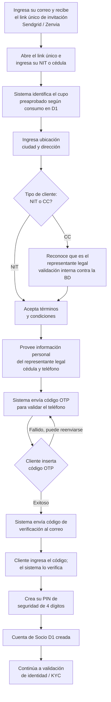

# 2. Onboarding digital

[← Volver a Procesos](README.md)

## Objetivo

Registrar al cliente empresarial en la plataforma de Fliipa y preparar el recorrido de origen del crédito para que pueda avanzar a validación de identidad y riesgo.

## Descripción general

El proceso empieza cuando el cliente recibe un correo con un link único de invitación y accede a la plataforma para completar la información inicial. Durante el onboarding, el sistema identifica el cupo preaprobado según el consumo en D1, solicita ubicación, valida si el cliente es un NIT o un caso de cédula/CC y recoge la información del representante legal. Luego se valida el teléfono mediante OTP, se confirma el correo, se crea el PIN de seguridad y se genera la cuenta de socio D1. Cuando la información está completa, el flujo continúa a validación de identidad y KYC.

## Actores involucrados

- Cliente empresarial: completa la información inicial, valida su teléfono y correo, y crea el PIN.
- Sistema de onboarding: identifica el cupo, solicita datos, valida OTP y crea la cuenta de socio D1.
- D1: aporta el contexto de consumo que permite identificar el cupo preaprobado.

## Flujo del proceso

## Referencia visual del journey

- Página 2 del journey Colpatria B2B (junio 2026): onboarding, NIT/CC, ubicación y OTP.
- Fuente visual de respaldo para validar la secuencia documentada en este proceso.

## Explicación paso a paso

1. Invitación por correo
   - Qué sucede: el cliente recibe el link único de invitación y accede a la plataforma.
   - Qué actor interviene: cliente empresarial.
   - Qué sistema participa: envío de correos y enlace único.
   - Qué información se utiliza: correo del cliente y enlace de acceso.
   - Qué decisión se toma: si el cliente accede para iniciar el registro.
   - Qué ocurre si el resultado es positivo: continúa con la captura de datos.
   - Qué ocurre si el resultado es negativo: no se inicia el onboarding.

2. Identificación del cupo preaprobado
   - Qué sucede: el sistema asocia la solicitud a la capacidad de crédito disponible según el consumo en D1.
   - Qué actor interviene: sistema de onboarding.
   - Qué sistema participa: motor de identificación del cupo.
   - Qué información se utiliza: consumo histórico en D1 y datos del cliente.
   - Qué decisión se toma: si el cliente cuenta con un cupo preaprobado.
   - Qué ocurre si el resultado es positivo: se continúa con el registro.
   - Qué ocurre si el resultado es negativo: el proceso queda bloqueado o se descarta.

3. Registro de ubicación
   - Qué sucede: se captura la ciudad y la dirección del cliente.
   - Qué actor interviene: cliente empresarial.
   - Qué sistema participa: formulario de registro.
   - Qué información se utiliza: ubicación del negocio o del representante legal.
   - Qué decisión se toma: si la información de ubicación es suficiente.
   - Qué ocurre si el resultado es positivo: se avanza al tipo de cliente.
   - Qué ocurre si el resultado es negativo: se solicita completar la información.

4. Clasificación por tipo de cliente
   - Qué sucede: el sistema define si el caso corresponde a un NIT o a un cliente con cédula/CC.
   - Qué actor interviene: sistema y cliente.
   - Qué sistema participa: validación interna contra la base de datos.
   - Qué información se utiliza: tipo de identificación y registro de la persona.
   - Qué decisión se toma: si el cliente es el representante legal.
   - Qué ocurre si el resultado es positivo: se continúa con la captura de datos personales.
   - Qué ocurre si el resultado es negativo: se requiere revisar la información o detener el proceso.

5. Aceptación de términos y captura de datos personales
   - Qué sucede: el cliente acepta términos y proporciona datos del representante legal.
   - Qué actor interviene: cliente empresarial.
   - Qué sistema participa: formulario de onboarding.
   - Qué información se utiliza: cédula, teléfono y datos de contacto.
   - Qué decisión se toma: si la información es suficiente para avanzar.
   - Qué ocurre si el resultado es positivo: el sistema pasa a la validación telefónica.
   - Qué ocurre si el resultado es negativo: se solicita completar la información faltante.

6. Validación OTP del teléfono
   - Qué sucede: el sistema envía un código OTP para verificar el teléfono del usuario.
   - Qué actor interviene: sistema y cliente.
   - Qué sistema participa: servicio de envío y validación OTP.
   - Qué información se utiliza: número de teléfono capturado.
   - Qué decisión se toma: si el código es correcto.
   - Qué ocurre si el resultado es positivo: se continúa con la verificación por correo.
   - Qué ocurre si el resultado es negativo: se puede reenviar el código.

7. Verificación por correo
   - Qué sucede: se envía un código de verificación al correo y el cliente lo ingresa para confirmar la cuenta.
   - Qué actor interviene: sistema y cliente.
   - Qué sistema participa: servicio de verificación por correo.
   - Qué información se utiliza: correo del cliente y código recibido.
   - Qué decisión se toma: si la verificación es válida.
   - Qué ocurre si el resultado es positivo: se procede a la creación del PIN.
   - Qué ocurre si el resultado es negativo: se solicita volver a intentar.

8. Creación del PIN de seguridad
   - Qué sucede: el cliente crea un PIN de 4 dígitos para proteger su cuenta.
   - Qué actor interviene: cliente empresarial.
   - Qué sistema participa: creación de credenciales de acceso.
   - Qué información se utiliza: selección del PIN por parte del usuario.
   - Qué decisión se toma: si el PIN cumple con los requisitos de uso.
   - Qué ocurre si el resultado es positivo: se habilita la cuenta de socio D1.
   - Qué ocurre si el resultado es negativo: se solicita crear uno nuevo.

9. Creación de la cuenta de socio D1
   - Qué sucede: se crea la cuenta de socio y el flujo queda listo para continuar a KYC.
   - Qué actor interviene: sistema.
   - Qué sistema participa: proceso de registro de usuario.
   - Qué información se utiliza: datos ya validados del cliente.
   - Qué decisión se toma: si la cuenta queda activa para avanzar.
   - Qué ocurre si el resultado es positivo: el proceso continúa a validación de identidad.
   - Qué ocurre si el resultado es negativo: la cuenta no queda activa y el proceso se interrumpe.

## Reglas de negocio

- El onboarding debe iniciar con un link único enviado al correo del cliente.
- El sistema identifica el cupo preaprobado según el consumo en D1.
- La validación del teléfono se realiza mediante OTP.
- La verificación del correo es necesaria antes de crear la cuenta.
- El PIN de seguridad se crea como parte del registro inicial del socio D1.

## Entradas

- Correo del cliente.
- Identificación del cliente (NIT o cédula).
- Información de ubicación y datos del representante legal.
- Historial de consumo en D1 para identificar el cupo preaprobado.

## Salidas

- Cuenta de socio D1 creada.
- Datos de onboarding validados y disponibles para la siguiente etapa de KYC.
- Cliente habilitado para avanzar a validación de identidad y riesgo.

## Excepciones

- El cliente no recibe o no usa el link de invitación.
- El código OTP falla o no llega.
- La información de identidad o ubicación es incompleta.
- La validación interna contra la base de datos no confirma al representante legal.
- La cuenta no se activa correctamente y el proceso se detiene.

## Consideraciones

- El proceso original se reordena para priorizar la captura inicial y la validación de OTP antes de avanzar a KYC.
- El PIN de seguridad se documenta aquí para evitar duplicidad con el proceso de KYC.
- El tiempo estimado del onboarding es de aproximadamente 3 minutos.

## Pendientes de validación

> **Pendiente de validar con el dueño del proceso.** La secuencia del tipo de cliente y la validación interna contra la base de datos deben confirmarse con la fuente oficial del journey.

