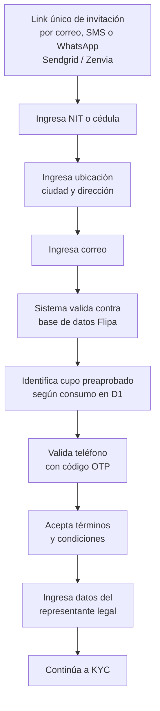

# 2. Onboarding digital

[← Volver a Procesos](README.md)

Duración total aproximada: **3 minutos**.

## Flujo

## Datos y validaciones

| Dato solicitado | Mecanismo de validación |
|------------------|--------------------------|
| NIT / cédula de ciudadanía | Contra base de datos de Flipa |
| Ubicación (ciudad, dirección) | Registro directo |
| Correo | Registro directo |
| Cupo preaprobado | Calculado con criterios de consumo en D1 |
| Teléfono | Código OTP (reenviable) |
| Representante legal | Registro directo |
