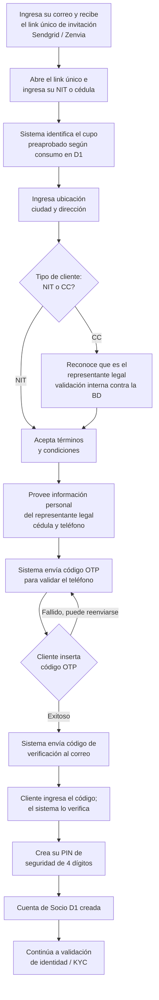

# 2. Onboarding digital

[← Volver a Procesos](README.md)

Duración total aproximada: **3 minutos**.

> **Corrección (2026-07-13):** esta versión reordena el flujo y agrega la bifurcación NIT/CC que faltaban, con base en las páginas 2 y 3 de `Journeys Fran finales.pdf` (Journeys Colpatria B2B, junio 2026). Cambios frente a la versión anterior: (1) "ingresa correo" pasa a ser el primer paso, no el cuarto; (2) el código OTP se valida al final del tramo de datos personales, no antes de aceptar términos; (3) se agrega la decisión "¿Tipo de cliente: NIT o CC?"; (4) se agregan los pasos de código de verificación por correo y creación del PIN, que en el journey ocurren antes de pasar a KYC.

## Flujo

## Datos y validaciones

| Paso | Dato / acción | Mecanismo de validación |
|------|-----------------|--------------------------|
| 1 | Correo | Recibe el link único de invitación (Sendgrid / Zenvia) |
| 2 | NIT o cédula de ciudadanía | Determina el cupo preaprobado, según consumo en D1 |
| 3 | Ubicación (ciudad, dirección) | Registro directo |
| 4 | Tipo de cliente (NIT o CC) | Si es CC, se valida contra la base de datos que el cliente es el representante legal |
| 5 | Representante legal (cédula, teléfono) | Registro directo |
| 6 | Teléfono | Código OTP, reenviable si no llega |
| 7 | Correo (segunda validación) | Código de verificación enviado al correo |
| 8 | PIN de seguridad | 4 dígitos, creado por el cliente |

> **Nota de alcance:** el paso 8 (creación del PIN) también aparece listado en [03-validacion-kyc.md](03-validacion-kyc.md). En el journey, el PIN se crea antes de la biometría, como parte del mismo tramo de onboarding — se recomienda quitarlo de 03 para no duplicarlo, dejando ese archivo enfocado en biometría, cuenta bancaria y documentos.

## Fuentes consultadas

- `Journeys Fran finales.pdf` (Journeys Colpatria B2B, junio 2026), páginas 2 y 3 — swimlanes "Cliente" y "Web"

