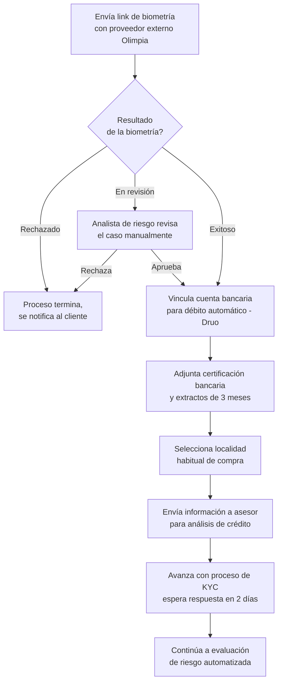

# 3. Validación de identidad (KYC)

[← Volver a Procesos](README.md)

## Control de versiones

| Versión | Fecha | Autor | Descripción de los cambios |
|----------|------------|----------------------|----------------------------|
| 1.0 | 2026-07-07 | Equipo de Producto | Creación inicial del documento de validación de identidad (KYC). |
| 1.1 | 2026-07-13 | María Fernanda Herazo | Reorganización del flujo según el journey oficial de junio de 2026. Se retiró el paso del PIN de seguridad (documentado en Onboarding Digital), se ajustó la secuencia para que la vinculación de cuenta bancaria, certificación bancaria y selección de localidad ocurran únicamente después de una biometría exitosa o aprobada manualmente, y se trasladó la nota de respuesta en dos días al envío a asesor para análisis de crédito. |

> **Corrección (2026-07-13):** se reordena el flujo con base en las páginas 3 y 4 de `Journeys Fran finales.pdf`...

## Pasos

| Paso | Detalle |
|------|---------|
| Verificación biométrica | Proveedor externo **Olimpia** (fuera de la app) |
| Cuenta bancaria | Vinculada y validada contra **Druo**, para débito automático — solo si la biometría fue exitosa o aprobada por el analista |
| Certificación bancaria | Extractos de los últimos 3 meses |
| Localidad de compra | Selección de la localidad habitual |
| Envío a asesor | Información enviada para análisis de crédito; el cliente espera respuesta en los próximos 2 días |

## Flujo y resultado de la biometría

> **Nota:** el analista de riesgo interviene únicamente cuando la biometría queda "en revisión" (identidad/fraude). La decisión de score y cupo de la siguiente etapa (ver [04-evaluacion-riesgo.md](04-evaluacion-riesgo.md)) es 100% automática desde el ajuste de junio de 2026 — el journey indica explícitamente que "se elimina el estudio manual del analista" en ese paso.

## Fuentes consultadas

- `Journeys Fran finales.pdf` (Journeys Colpatria B2B, junio 2026), páginas 3 ("Onboarding", swimlanes Cliente / Web / Analista de riesgo) y 4 ("KYC / Riesgo de crédito", nota sobre automatización)
