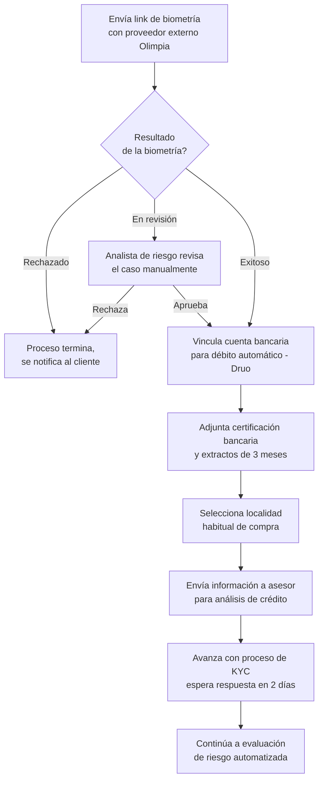

# 3. Validación de identidad (KYC)

[← Volver a Procesos](README.md)

## Control de versiones

| Versión | Fecha | Autor | Descripción de los cambios |
|----------|------------|----------------------|----------------------------|
| 1.0 | 2026-07-07 | Equipo de Producto | Creación inicial del documento de validación de identidad (KYC). |
| 1.1 | 2026-07-13 | María Fernanda Herazo | Reorganización del flujo según el journey oficial de junio de 2026. Se retiró el paso del PIN de seguridad (documentado en Onboarding Digital), se ajustó la secuencia para que la vinculación de cuenta bancaria, certificación bancaria y selección de localidad ocurran únicamente después de una biometría exitosa o aprobada manualmente, y se trasladó la nota de respuesta en dos días al envío a asesor para análisis de crédito. |

## Objetivo

Validar la identidad del cliente y completar la información necesaria para que el caso pueda avanzar a evaluación de riesgo y originación.

## Descripción general

El proceso inicia cuando el cliente recibe un link de biometría gestionado por Olimpia. Dependiendo del resultado, el flujo puede terminar, pasar a revisión manual por analista de riesgo o continuar con la vinculación de cuenta bancaria, certificación bancaria, selección de localidad y envío de información al asesor. La información recopilada sirve como base para la evaluación de riesgo automatizada del proceso siguiente.

## Actores involucrados

- Cliente empresarial: realiza la biometría y aporta la información de cuenta bancaria, certificación bancaria y localidad habitual.
- Proveedor de biometría Olimpia: ejecuta la validación biométrica externa.
- Analista de riesgo: revisa manualmente los casos marcados como "en revisión".
- Sistema de onboarding y riesgo: recibe la información y la encadena con la evaluación automatizada.

## Flujo del proceso

## Referencia visual del journey

- Página 3 del journey Colpatria B2B (junio 2026): biometría, cuenta bancaria y validación de identidad.
- Fuente visual de respaldo para validar la secuencia documentada en este proceso.

## Explicación paso a paso

1. Envío del link de biometría
   - Qué sucede: el cliente recibe una invitación para completar la validación biométrica con Olimpia.
   - Qué actor interviene: cliente empresarial y proveedor Olimpia.
   - Qué sistema participa: canal de biometría y flujo de onboarding.
   - Qué información se utiliza: datos del cliente y enlace de verificación.
   - Qué decisión se toma: si se inicia la validación.
   - Qué ocurre si el resultado es positivo: continúa el proceso.
   - Qué ocurre si el resultado es negativo: se termina el proceso o se notifica el caso.

2. Resultado de la biometría
   - Qué sucede: el sistema o el proveedor informa si la biometría fue exitosa, rechazada o queda en revisión.
   - Qué actor interviene: proveedor Olimpia y sistema.
   - Qué sistema participa: integración con biometría.
   - Qué información se utiliza: resultado de la validación biométrica.
   - Qué decisión se toma: si se continúa, se revisa manualmente o se detiene.
   - Qué ocurre si el resultado es positivo: se continúa con la vinculación de cuenta bancaria.
   - Qué ocurre si el resultado es negativo: el proceso se detiene o se deriva a revisión manual.

3. Revisión manual por analista de riesgo
   - Qué sucede: el caso queda en revisión para validar identidad o fraude.
   - Qué actor interviene: analista de riesgo.
   - Qué sistema participa: flujo de casos en revisión.
   - Qué información se utiliza: resultado de biometría y contexto del cliente.
   - Qué decisión se toma: si se aprueba o rechaza el caso.
   - Qué ocurre si el resultado es positivo: se continúa con el flujo.
   - Qué ocurre si el resultado es negativo: se notifica el rechazo y se finaliza el proceso.

4. Vinculación de cuenta bancaria
   - Qué sucede: si la biometría fue exitosa o aprobada, se vincula la cuenta bancaria para débito automático.
   - Qué actor interviene: cliente empresarial y sistema.
   - Qué sistema participa: integración con Druo.
   - Qué información se utiliza: cuenta bancaria del cliente y estado de la biometría.
   - Qué decisión se toma: si la cuenta puede integrarse al proceso.
   - Qué ocurre si el resultado es positivo: se avanza a documentación bancaria.
   - Qué ocurre si el resultado es negativo: el proceso queda bloqueado o requiere corrección.

5. Certificación bancaria y extractos
   - Qué sucede: se adjunta la certificación bancaria y los extractos de los últimos 3 meses.
   - Qué actor interviene: cliente empresarial.
   - Qué sistema participa: captura documental y carga de archivos.
   - Qué información se utiliza: información bancaria y estados de cuenta.
   - Qué decisión se toma: si la información es suficiente para continuar.
   - Qué ocurre si el resultado es positivo: se pasa a la selección de localidad.
   - Qué ocurre si el resultado es negativo: se solicita información adicional.

6. Selección de localidad habitual
   - Qué sucede: el cliente selecciona la localidad donde realiza sus compras habituales.
   - Qué actor interviene: cliente empresarial.
   - Qué sistema participa: formulario de onboarding.
   - Qué información se utiliza: datos de negocio y contexto comercial.
   - Qué decisión se toma: si la información de localidad es válida.
   - Qué ocurre si el resultado es positivo: se envía la información al asesor.
   - Qué ocurre si el resultado es negativo: se solicita corregir o completar.

7. Envío a asesor para análisis de crédito
   - Qué sucede: la información se comparte con el asesor para el análisis de crédito.
   - Qué actor interviene: asesor y sistema.
   - Qué sistema participa: flujo de asignación y envío de información.
   - Qué información se utiliza: datos de KYC, cuenta bancaria y localidad.
   - Qué decisión se toma: si el caso continúa a evaluación de riesgo automatizada.
   - Qué ocurre si el resultado es positivo: se espera respuesta en 2 días.
   - Qué ocurre si el resultado es negativo: el caso se detiene o requiere revisión adicional.

8. Continuación a evaluación de riesgo
   - Qué sucede: el proceso pasa a la evaluación automatizada de riesgo.
   - Qué actor interviene: sistema de riesgo.
   - Qué sistema participa: motor de evaluación de riesgo.
   - Qué información se utiliza: datos convalidados del KYC.
   - Qué decisión se toma: si se aprueba o rechaza el crédito.
   - Qué ocurre si el resultado es positivo: continúa el proceso de originación.
   - Qué ocurre si el resultado es negativo: el cliente recibe notificación de rechazo.

## Reglas de negocio

- La biometría es un paso obligatorio para avanzar con la validación de identidad.
- La cuenta bancaria solo se vincula si la biometría fue exitosa o aprobada manualmente.
- La certificación bancaria y los extractos de 3 meses deben adjuntarse para completar el KYC.
- El analista de riesgo interviene solo cuando la biometría queda en revisión.
- El proceso avanza a evaluación de riesgo automatizada después del envío al asesor.

## Entradas

- Link de biometría enviado por el sistema.
- Datos del cliente y del representante legal.
- Cuenta bancaria para débito automático.
- Certificación bancaria y extractos de los últimos 3 meses.
- Información de localidad habitual.

## Salidas

- Caso de KYC validado o rechazado.
- Información completa enviada al asesor para análisis de crédito.
- Continuidad al proceso de evaluación de riesgo automatizada.

## Excepciones

- La biometría es rechazada.
- La biometría queda en revisión y requiere aprobación manual.
- La vinculación de la cuenta bancaria falla.
- La información documental es incompleta.
- El caso no alcanza la evaluación de riesgo por falta de datos o por rechazo manual.

## Consideraciones

- El ajuste de junio de 2026 elimina la revisión manual del analista en la etapa de score y cupo.
- El analista de riesgo interviene únicamente en la revisión de la biometría y no en la evaluación de riesgo automatizada.
- El tiempo de respuesta esperado después del envío al asesor es de 2 días.

## Pendientes de validación

> **Pendiente de validar con el dueño del proceso.** La integración exacta con Olimpia y la política de revisión manual deben confirmarse con negocio y riesgo.
