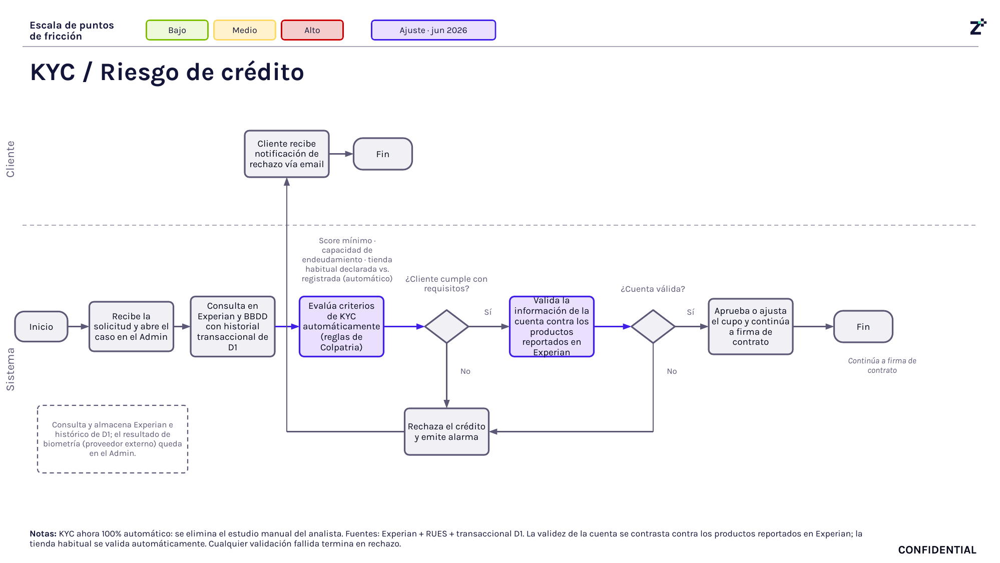

# 3. Validación de identidad (KYC)

## Objetivo

Validar automáticamente la identidad del cliente y evaluar si cumple los criterios mínimos de riesgo utilizando información proveniente de Experian, el historial transaccional de D1 y las reglas de negocio definidas para el producto. Al finalizar este proceso se determina si la solicitud continúa hacia la firma del contrato o si el crédito es rechazado.

---

## Journey

**Figura 4. Journey de Validación de Identidad (KYC) y Evaluación Inicial de Riesgo.**

Este journey representa el proceso de validación automática de identidad y riesgo que se ejecuta una vez finalizado el onboarding digital. Durante esta etapa el sistema consulta información en Experian y el historial transaccional de D1, aplica las reglas de negocio definidas para el KYC, valida la cuenta bancaria registrada y determina si la solicitud puede continuar hacia la firma del contrato o si debe ser rechazada.

---

## Descripción general

Una vez el cliente finaliza el proceso de onboarding digital, la solicitud ingresa automáticamente al proceso de Validación de Identidad (KYC). En esta etapa el sistema recopila la información obtenida durante el onboarding, consulta fuentes externas como Experian y el historial transaccional de D1, y ejecuta de forma automática las reglas de negocio establecidas para evaluar la elegibilidad del cliente.

Si el cliente cumple con todos los criterios definidos, el sistema valida la cuenta bancaria registrada y aprueba o ajusta el cupo de crédito antes de continuar con la firma del contrato. En caso de que alguna validación falle, la solicitud es rechazada automáticamente y el cliente recibe una notificación por correo electrónico.

---

## Explicación del Journey

### 1. Recepción de la solicitud

Una vez finalizado el onboarding digital, el sistema recibe la solicitud y crea automáticamente el caso dentro del módulo administrativo. A partir de este momento inicia el proceso de Validación de Identidad (KYC) sin intervención del cliente.

---

### 2. Consulta de información en Experian y D1

El sistema consulta la información disponible en Experian y el historial transaccional del cliente en D1. Estas consultas permiten complementar la información obtenida durante el onboarding y proporcionan los datos necesarios para ejecutar la evaluación automática del riesgo.

---

### 3. Evaluación automática de criterios KYC

Con la información recopilada, el sistema aplica automáticamente las reglas de negocio definidas para el proceso KYC.

Entre los criterios evaluados se encuentran:

- Puntaje mínimo requerido.
- Capacidad de endeudamiento.
- Historial transaccional del cliente en D1.
- Tienda habitual registrada.
- Reglas de riesgo definidas para el producto.

Esta evaluación se realiza completamente de forma automática.

---

### 4. Verificación de cumplimiento de requisitos

Una vez ejecutadas las reglas de negocio, el sistema determina si el cliente cumple con los requisitos mínimos para continuar.

Si el cliente no cumple alguno de los criterios establecidos, la solicitud es rechazada automáticamente y se genera una alerta dentro del sistema.

Si cumple todos los requisitos, el proceso continúa con la validación de la cuenta bancaria.

---

### 5. Validación de la cuenta bancaria

El sistema compara la cuenta bancaria registrada durante el onboarding con la información reportada en Experian y otros productos financieros asociados al cliente.

Esta validación busca confirmar que la cuenta registrada corresponde al cliente y que la información es consistente antes de continuar con la originación del crédito.

---

### 6. Verificación de la cuenta bancaria

El sistema determina si la cuenta bancaria es válida.

- Si la validación es exitosa, la solicitud continúa hacia la aprobación o ajuste del cupo de crédito.
- Si la validación falla, el crédito es rechazado automáticamente y el proceso finaliza.

---

### 7. Aprobación o ajuste del cupo de crédito

Cuando todas las validaciones son satisfactorias, el sistema aprueba la solicitud o ajusta el cupo de crédito de acuerdo con las reglas de negocio y los resultados obtenidos durante la evaluación.

Posteriormente, la solicitud continúa hacia la firma del contrato.

---

### 8. Rechazo automático del crédito

Si cualquiera de las validaciones automáticas falla durante el proceso, el sistema rechaza la solicitud y registra una alerta para mantener la trazabilidad de la decisión.

---

### 9. Notificación al cliente

Cuando el crédito es rechazado, el sistema envía automáticamente una notificación al cliente por correo electrónico informando que la solicitud no fue aprobada.

Con esta acción finaliza el proceso de Validación de Identidad (KYC).

---

## Reglas de negocio

- El proceso KYC se ejecuta completamente de forma automática.
- La consulta a Experian y al historial transaccional de D1 es obligatoria.
- El cliente debe cumplir el puntaje mínimo definido para el producto.
- Se evalúa automáticamente la capacidad de endeudamiento del cliente.
- La tienda habitual registrada hace parte de las reglas de evaluación.
- La cuenta bancaria debe coincidir con la información reportada por Experian.
- Si cualquiera de las validaciones falla, la solicitud es rechazada automáticamente.
- Solo las solicitudes aprobadas continúan hacia la firma del contrato.

---

## Entradas

- Información del cliente registrada durante el onboarding.
- Resultado de la validación biométrica.
- Historial transaccional de D1.
- Información consultada en Experian.
- Cuenta bancaria registrada por el cliente.
- Reglas de negocio definidas para el proceso KYC.

---

## Salidas

- Cliente aprobado para continuar con la firma del contrato.
- Cupo de crédito aprobado o ajustado.
- Solicitud rechazada.
- Alerta registrada en el sistema.
- Notificación enviada al cliente.

---

## Excepciones

- El cliente no cumple el puntaje mínimo requerido.
- La capacidad de endeudamiento supera los límites permitidos.
- La información consultada en Experian presenta inconsistencias.
- La cuenta bancaria registrada no coincide con la información validada.
- Error durante la consulta a Experian.
- Error durante la consulta del historial transaccional de D1.
- Error en la ejecución de las reglas automáticas del proceso KYC.

---

## Consideraciones

- El proceso de Validación de Identidad (KYC) es completamente automático y no requiere intervención manual.
- El resultado de la biometría obtenida durante el onboarding es uno de los insumos utilizados en esta evaluación.
- La validación de la cuenta bancaria se realiza antes de aprobar definitivamente el cupo de crédito.
- Cualquier validación fallida genera el rechazo automático de la solicitud.
- Las reglas de evaluación pueden modificarse conforme evolucione la estrategia de riesgo del producto.

---

## Pendientes de validación

> **Pendiente de validar con el dueño del proceso:** confirmar si el ajuste del cupo de crédito puede realizarse mediante reglas parametrizadas adicionales antes de la firma del contrato y validar si existen criterios complementarios no reflejados en el journey.

---

## Fuentes consultadas

- *Journeys Colpatria B2B* (junio de 2026), página 4.
- Documentación funcional del proceso KYC.
- Documento de reglas de negocio del producto.
- Documento de Alcance del Producto.

