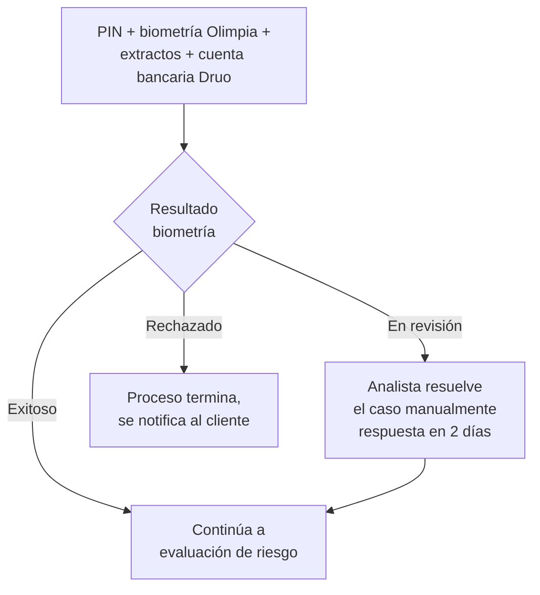

# 3. Validación de identidad (KYC)

[← Volver a Procesos](README.md)

## Pasos

| Paso | Detalle |
|------|---------|
| PIN de seguridad | 4 dígitos |
| Verificación biométrica | Proveedor externo **Olimpia** (fuera de la app) |
| Certificación bancaria | Extractos de los últimos 3 meses |
| Cuenta bancaria | Vinculada y validada contra **Druo** |
| Localidad de compra | Selección de la localidad habitual |

## Flujo y resultado de la biometría

