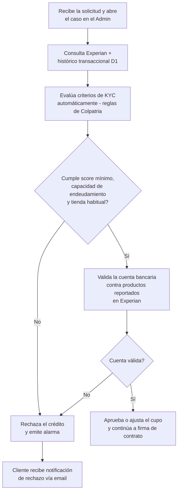

# 4. Evaluación de riesgo

[← Volver a Procesos](README.md)

| Documento | Evaluación de riesgo |
|-----------|------------------------|
| **Proyecto** | Fliipa |
| **Versión** | 2.1 |
| **Estado** | Borrador para validación |
| **Responsable** | Riesgo y crédito |
| **Última actualización** | 2026-07-13 |

---

## Control de versiones

| Versión | Fecha | Autor | Descripción |
|---------|-------|-------|-------------|
| 1.0 | 2026-07-09 | María Fernanda Herazo (con asistencia de Claude) | Versión inicial, como sección 4 del `procesos.md` original (monolítico). |
| 2.0 | 2026-07-13 | María Fernanda Herazo (con asistencia de Claude) | Reorganización en archivo independiente con diagrama Mermaid, dentro del split de `negocio/procesos/`. |
| 2.1 | 2026-07-13 | María Fernanda Herazo (con asistencia de Claude) | Corrección solicitada tras validar contra la página 4 de `Journeys Fran finales.pdf` (Journeys Colpatria B2B, junio 2026): se separa la evaluación de criterios de KYC (score, endeudamiento, tienda habitual — "reglas de Colpatria") de la validación de la cuenta bancaria contra Experian, como dos decisiones **consecutivas** en el orden correcto (antes aparecían fusionadas en una sola decisión y en el orden invertido). Se agrega el paso inicial de apertura del caso y la cita explícita a "reglas de Colpatria".

---

## Fuentes y criterios

| Fuente | Uso |
|--------|-----|
| Experian | (1) Score crediticio, como parte de los criterios de KYC; (2) validación de la cuenta bancaria contra los productos reportados, en un segundo paso independiente |
| Histórico transaccional D1 | Contraste con la tienda habitual declarada |
| Reglas de Colpatria | Motor que evalúa automáticamente los criterios de KYC (score, endeudamiento, tienda) |
| Score mínimo | Criterio de aprobación (gate 1) |
| Capacidad de endeudamiento | Criterio de aprobación (gate 1) |
| Cuenta bancaria válida | Criterio de aprobación (gate 2, posterior al gate 1) |

## Flujo

> **Nota:** desde el ajuste de junio de 2026, esta evaluación es 100% automática — el journey indica explícitamente "se elimina el estudio manual del analista" en este paso (ver también la nota equivalente en [03-validacion-kyc.md](03-validacion-kyc.md), donde el analista de riesgo solo interviene en la revisión de biometría, no aquí).

## Fuentes consultadas

- `Journeys Fran finales.pdf` (Journeys Colpatria B2B, junio 2026), página 4 ("KYC / Riesgo de crédito", swimlanes Cliente / Sistema)
