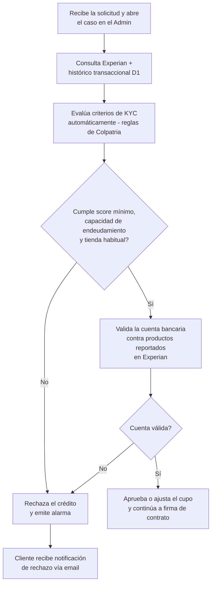

# 4. Evaluación de riesgo

[← Volver a Procesos](README.md)

| Documento | Evaluación de riesgo |
|-----------|------------------------|
| **Proyecto** | Fliipa |
| **Versión** | 2.1 |
| **Estado** | Borrador para validación |
| **Responsable** | Riesgo y crédito |
| **Última actualización** | 2026-07-13 |

---

## Control de versiones

| Versión | Fecha | Autor | Descripción |
|---------|-------|-------|-------------|
| 1.0 | 2026-07-09 | María Fernanda Herazo| Versión inicial, como sección 4 del `procesos.md` original (monolítico). |
| 2.0 | 2026-07-13 | María Fernanda Herazo  | Reorganización en archivo independiente con diagrama Mermaid, dentro del split de `negocio/procesos/`. |
| 2.1 | 2026-07-13 | María Fernanda Herazo | Corrección solicitada tras validar contra la página 4 de `Journeys Fran finales.pdf` (Journeys Colpatria B2B, junio 2026): se separa la evaluación de criterios de KYC (score, endeudamiento, tienda habitual — "reglas de Colpatria") de la validación de la cuenta bancaria contra Experian, como dos decisiones **consecutivas** en el orden correcto (antes aparecían fusionadas en una sola decisión y en el orden invertido). Se agrega el paso inicial de apertura del caso y la cita explícita a "reglas de Colpatria".

## Objetivo

Determinar si el cliente cumple con los criterios de riesgo para aprobar, ajustar o rechazar el crédito antes de continuar a la firma de contrato.

## Descripción general

El proceso empieza cuando el caso es abierto en el admin y el sistema consulta Experian y el histórico transaccional de D1. Luego evalúa automáticamente los criterios de KYC con base en las reglas de Colpatria y decide si el cliente cumple con el score mínimo, la capacidad de endeudamiento y la tienda habitual. Si pasa esa primera validación, se revisa la cuenta bancaria reportada en Experian. Si la cuenta es válida, se aprueba o ajusta el cupo; si no, se rechaza el crédito y se emite una alarma.

## Actores involucrados

- Sistema de riesgo: ejecuta la evaluación automatizada y toma la decisión inicial.
- Experian y D1: aportan la información de score, historial y cuenta bancaria.
- Cliente empresarial: recibe la notificación de aprobación o rechazo.
- Admin: abre el caso y da entrada al proceso.

## Flujo del proceso

## Referencia visual del journey

- Página 4 del journey Colpatria B2B (junio 2026): evaluación de riesgo, Experian, score y cupo.
- Fuente visual de respaldo para validar la secuencia documentada en este proceso.

## Explicación paso a paso

1. Apertura del caso
   - Qué sucede: el caso se recibe y se abre en el admin para iniciar la evaluación.
   - Qué actor interviene: admin y sistema.
   - Qué sistema participa: módulo de administración del caso.
   - Qué información se utiliza: solicitud del cliente y datos básicos del caso.
   - Qué decisión se toma: si el caso entra a evaluación.
   - Qué ocurre si el resultado es positivo: se continúa con la consulta de datos.
   - Qué ocurre si el resultado es negativo: el caso no entra al proceso.

2. Consulta a Experian y al histórico de D1
   - Qué sucede: el sistema consulta la información de riesgo y transaccional del cliente.
   - Qué actor interviene: sistema de riesgo.
   - Qué sistema participa: Experian y fuente transaccional de D1.
   - Qué información se utiliza: score, historial y datos del cliente.
   - Qué decisión se toma: si existe suficiente información para evaluar.
   - Qué ocurre si el resultado es positivo: se avanza a criterios de KYC.
   - Qué ocurre si el resultado es negativo: el caso queda incompleto o se rechaza.

3. Evaluación de criterios de KYC
   - Qué sucede: el sistema valida score mínimo, capacidad de endeudamiento y tienda habitual con base en reglas de Colpatria.
   - Qué actor interviene: sistema.
   - Qué sistema participa: motor de reglas de Colpatria.
   - Qué información se utiliza: score, endeudamiento y tienda habitual declarada.
   - Qué decisión se toma: si el cliente pasa el gate 1.
   - Qué ocurre si el resultado es positivo: se continúa con la validación de cuenta bancaria.
   - Qué ocurre si el resultado es negativo: se rechaza el crédito y se emite alarma.

4. Validación de cuenta bancaria en Experian
   - Qué sucede: se valida si la cuenta bancaria reportada coincide con productos reportados y es válida.
   - Qué actor interviene: sistema.
   - Qué sistema participa: Experian.
   - Qué información se utiliza: cuenta bancaria y reportes asociados.
   - Qué decisión se toma: si la cuenta supera el gate 2.
   - Qué ocurre si el resultado es positivo: se aprueba o ajusta el cupo.
   - Qué ocurre si el resultado es negativo: se rechaza el crédito.

5. Decisión final de aprobación o rechazo
   - Qué sucede: el sistema define si el crédito se aprueba, ajusta o rechaza.
   - Qué actor interviene: sistema y cliente.
   - Qué sistema participa: motor de decisión de crédito.
   - Qué información se utiliza: resultados de los gates 1 y 2.
   - Qué decisión se toma: si el caso continúa a firma de contrato.
   - Qué ocurre si el resultado es positivo: se avanza a la siguiente etapa.
   - Qué ocurre si el resultado es negativo: el cliente recibe notificación de rechazo.

## Reglas de negocio

- La evaluación de riesgo es automática y no depende de revisión manual del analista.
- Se deben validar tres criterios de KYC: score mínimo, capacidad de endeudamiento y tienda habitual.
- La cuenta bancaria debe validar contra productos reportados en Experian.
- Si alguno de los gates no se cumple, el crédito se rechaza.
- Si el cliente aprueba los gates, el cupo se aprueba o ajusta y se continúa a firma de contrato.

## Entradas

- Solicitud abierta en el admin.
- Datos de riesgo de Experian.
- Histórico transaccional de D1.
- Información de la cuenta bancaria del cliente.

## Salidas

- Decisión de aprobación, ajuste o rechazo del crédito.
- Cupo aprobado o ajustado para la etapa siguiente.
- Notificación de rechazo al cliente cuando aplica.

## Excepciones

- El cliente no cumple con el score mínimo o la capacidad de endeudamiento.
- La tienda habitual no coincide con el histórico de D1.
- La cuenta bancaria no es válida o no coincide con los reportes.
- El sistema no encuentra suficiente información para evaluar.
- La decisión final obliga a rechazar el crédito.

## Consideraciones

- La evaluación se ajusta a la lógica de junio de 2026 en la que se elimina el estudio manual del analista.
- La etapa de riesgo está conectada con la validación de identidad y con la firma del contrato.
- Se recomienda mantener alineadas las reglas de riesgo con la documentación de negocio y funcional.

## Pendientes de validación

> **Pendiente de validar con el dueño del proceso.** La regla exacta de score y capacidad de endeudamiento debe confirmarse con negocio y riesgo.
