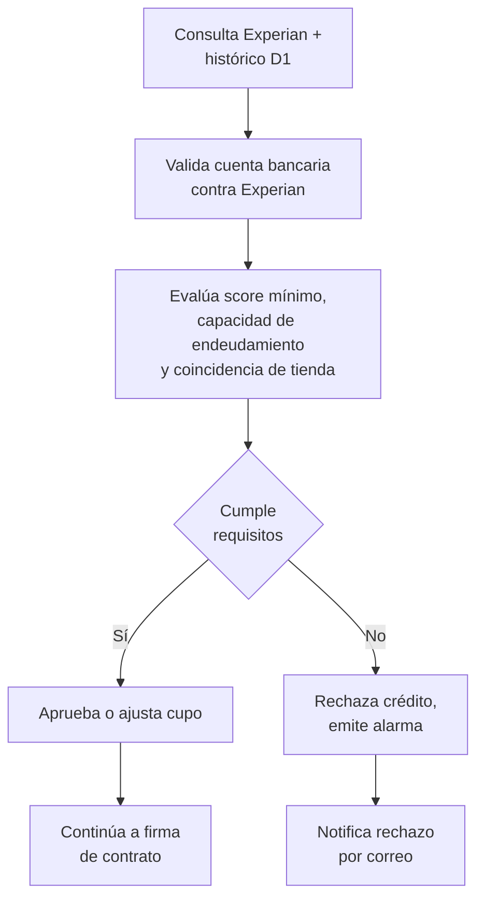

# 4. Evaluación de riesgo

[← Volver a Procesos](README.md)

## Fuentes y criterios

| Fuente | Uso |
|--------|-----|
| Experian | Score crediticio y validación de la cuenta bancaria contra productos reportados |
| Histórico transaccional D1 | Contraste con la tienda habitual declarada |
| Score mínimo | Criterio de aprobación |
| Capacidad de endeudamiento | Criterio de aprobación |

## Flujo

