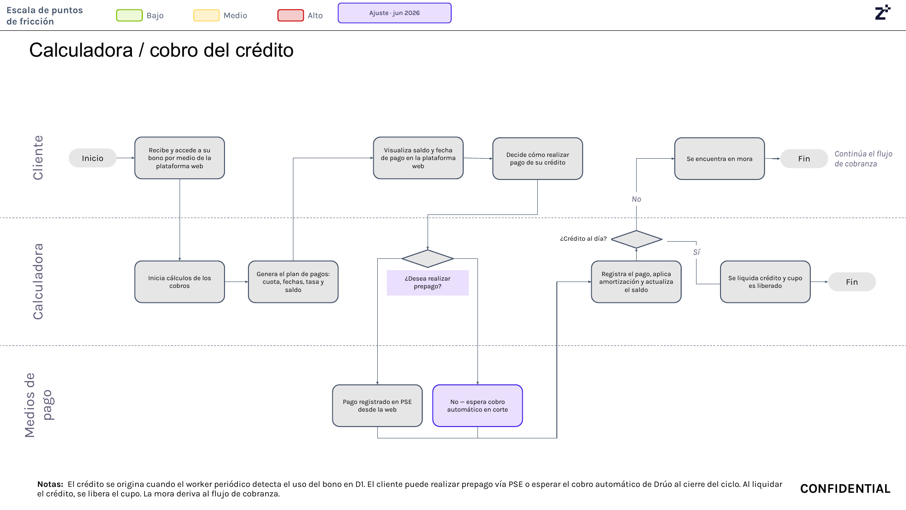

# 5. Calculadora y cobro del crédito

## Objetivo

Administrar el ciclo de pago del crédito una vez el cliente utiliza el bono D1, calculando automáticamente el plan de pagos, permitiendo realizar pagos anticipados o esperar el débito automático, actualizando el saldo del crédito y determinando si la obligación queda al día, se liquida completamente o continúa hacia el proceso de cobranza.

---

## Journey

El recorrido se explica a continuación en texto narrativo y la imagen del journey sirve como referencia visual para validar la secuencia operativa.

**Figura 6. Journey de Calculadora y Cobro del Crédito.**

---

## Descripción general

Una vez el cliente utiliza el bono D1, el sistema origina automáticamente el crédito y genera el plan de pagos correspondiente. El cliente puede consultar desde la plataforma web el saldo pendiente, la fecha de pago, la tasa de interés y las cuotas asociadas al crédito.

Posteriormente, el cliente decide si desea realizar un pago anticipado mediante PSE o esperar el débito automático programado. Después de registrar el pago, el sistema actualiza el saldo y verifica si el crédito quedó completamente cancelado. Cuando la obligación es liquidada, el cupo de crédito vuelve a estar disponible; de lo contrario, si existe mora, el caso continúa hacia el proceso de cobranza.

---

## Explicación paso a paso

### 1. Uso del bono D1

El proceso inicia cuando el cliente utiliza el bono D1 para realizar una compra. Esta acción genera automáticamente la originación del crédito y activa el proceso de cálculo de la obligación financiera.

---

### 2. Cálculo del plan de pagos

La calculadora financiera inicia el procesamiento del crédito y genera el plan de pagos correspondiente, incluyendo las cuotas, fechas de vencimiento, tasa de interés y saldo inicial de la obligación.

Esta información queda disponible para que el cliente pueda consultarla desde la plataforma.

---

### 3. Consulta del estado del crédito

El cliente ingresa a la plataforma web y consulta la información de su crédito, incluyendo:

- Saldo pendiente.
- Fecha de pago.
- Valor de las cuotas.
- Estado del crédito.

Con esta información el cliente decide cómo realizará el pago.

---

### 4. Selección del método de pago

El cliente puede elegir entre dos alternativas:

- Realizar un prepago utilizando PSE desde la plataforma web.
- Esperar el débito automático programado para la fecha de corte mediante la cuenta bancaria previamente vinculada.

Ambas opciones continúan hacia el registro del pago.

---

### 5. Registro del pago

Una vez se recibe el pago (ya sea mediante PSE o débito automático), el sistema registra la transacción, aplica la amortización correspondiente y actualiza el saldo pendiente del crédito.

Esta actualización refleja inmediatamente el nuevo estado de la obligación.

---

### 6. Validación del estado del crédito

Después de actualizar el saldo, el sistema verifica si el crédito quedó completamente al día.

- Si la obligación fue cancelada en su totalidad, el crédito se liquida y el cupo vuelve a quedar disponible para futuras compras.
- Si aún existe una obligación pendiente, el crédito continúa activo hasta completar su pago.
- Si el cliente incumple la fecha de pago, el crédito entra en estado de mora y continúa hacia el proceso de cobranza.

---

### 7. Liquidación del crédito

Cuando el saldo llega a cero, el sistema marca el crédito como liquidado y libera nuevamente el cupo aprobado para que el cliente pueda utilizarlo en futuras compras.

Con este paso finaliza el ciclo operativo del crédito.

---

### 8. Inicio del proceso de cobranza

Si el cliente no realiza el pago dentro de los plazos establecidos, el sistema clasifica la obligación como cartera en mora y el caso continúa automáticamente hacia el proceso de cobranza, donde se ejecutan las estrategias de recuperación definidas por el negocio.

---

## Reglas de negocio

- El crédito únicamente se origina cuando el cliente utiliza el bono D1.
- El sistema genera automáticamente el plan de pagos después de originar el crédito.
- El cliente puede realizar pagos anticipados mediante PSE.
- Si el cliente no realiza un prepago, el sistema ejecuta el débito automático en la fecha de corte utilizando la cuenta bancaria previamente vinculada.
- Cada pago recibido actualiza automáticamente el saldo del crédito.
- Cuando el saldo llega a cero, el crédito se liquida y el cupo vuelve a estar disponible.
- Si el pago no se realiza oportunamente, el caso continúa hacia el proceso de cobranza.

---

## Entradas

- Crédito originado por el uso del bono D1.
- Información financiera del crédito.
- Plan de pagos generado.
- Cuenta bancaria registrada.
- Pago recibido mediante PSE o débito automático.

---

## Salidas

- Plan de pagos calculado.
- Saldo del crédito actualizado.
- Crédito liquidado.
- Cupo nuevamente disponible.
- Caso enviado al proceso de cobranza cuando exista mora.

---

## Excepciones

- El cliente no realiza el prepago.
- El débito automático no puede ejecutarse correctamente.
- El pago es rechazado por la entidad financiera.
- El cliente incurre en mora.
- Se presenta un error durante la actualización del saldo.
- El caso debe ser transferido al proceso de cobranza.

---

## Pendientes de validación

> **Pendiente de validar con el dueño del proceso.**

Aspectos que deben confirmarse:

- El tiempo exacto entre el uso del bono y la generación del crédito.
- Las reglas de cálculo de intereses y amortización.
- Las condiciones para permitir pagos anticipados parciales.
- La frecuencia de ejecución del débito automático.
- Las reglas para liberar nuevamente el cupo de crédito después de la liquidación.