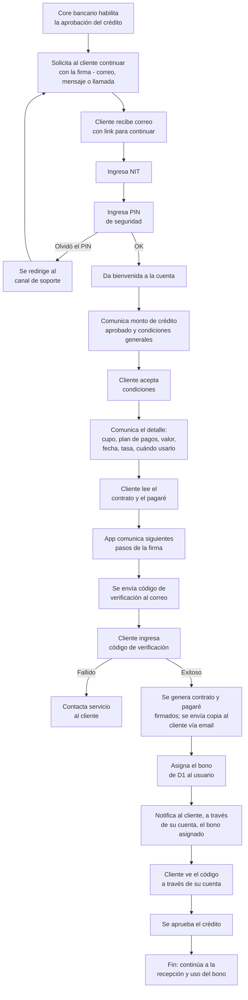

# 5. Firma de contrato y activación

[← Volver a Procesos](README.md)

| Documento | Firma de contrato y activación |
|-----------|----------------------------------|
| **Proyecto** | Fliipa |
| **Versión** | 2.1 |
| **Estado** | Borrador para validación |
| **Responsable** | Riesgo y crédito |
| **Última actualización** | 2026-07-13 |

---

## Control de versiones

| Versión | Fecha | Autor | Descripción |
|---------|-------|-------|-------------|
| 1.0 | 2026-07-09 | María Fernanda Herazo | Versión inicial, como sección 5 del `procesos.md` original (monolítico). |
| 2.0 | 2026-07-13 | María Fernanda Herazo  | Reorganización en archivo independiente con diagrama Mermaid, dentro del split de `negocio/procesos/`. |
| 2.1 | 2026-07-13 | María Fernanda Herazo  | Corrección solicitada tras validar contra las páginas 5 y 6 de `Journeys Fran finales.pdf`: se agrega el arranque del proceso (habilitación del crédito, solicitud de continuar la firma, link por correo); se corrige el orden — el cliente **acepta condiciones** (resumen general) antes de que el sistema muestre el detalle y el cliente **lea el contrato y el pagaré** (paso nuevo de junio 2026), no al revés; se agregan las bifurcaciones de PIN olvidado y de código de verificación fallido; se agregan los pasos finales de notificación del bono y visualización del código, que faltaban antes de "se aprueba el crédito". |

---

## Elementos revisados por el cliente

| Elemento | Detalle |
|----------|---------|
| Cupo aprobado | Monto final |
| Plan de pagos | Cuotas y fechas |
| Valor a pagar | Total con intereses |
| Fecha de pago | Fecha de corte |
| Tasa de interés | Tasa aplicable |
| Cuándo podrá usarlo | Momento de activación del cupo |

## Flujo

## Fuentes consultadas

- `Journeys Fran finales.pdf` (Journeys Colpatria B2B, junio 2026), páginas 5 y 6 ("Firma de contrato", swimlanes Cliente / Web / Core Bancario / Core de Crédito-Originación)
