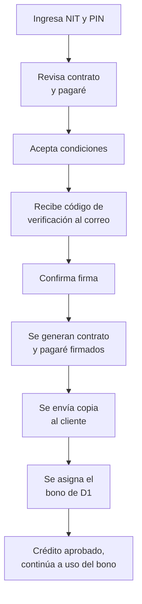

# 5. Firma de contrato y activación

[← Volver a Procesos](README.md)

## Elementos revisados por el cliente

| Elemento | Detalle |
|----------|---------|
| Cupo aprobado | Monto final |
| Plan de pagos | Cuotas y fechas |
| Valor a pagar | Total con intereses |
| Fecha de pago | Fecha de corte |
| Tasa de interés | Tasa aplicable |

## Flujo

