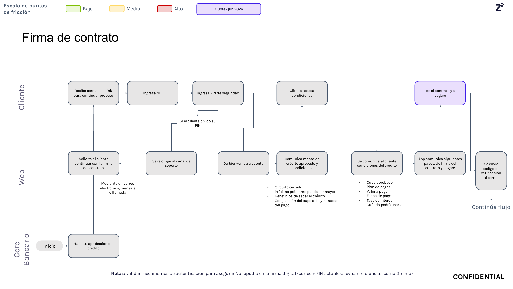
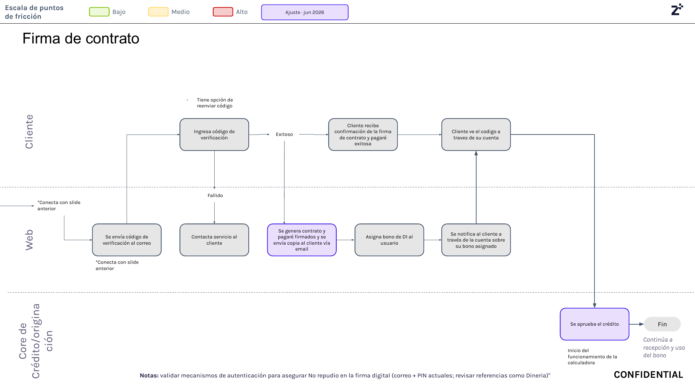

# 5. Firma de contrato y activación

[← Volver a Procesos](README.md)

| Documento | Firma de contrato y activación |
|-----------|----------------------------------|
| **Proyecto** | Fliipa |
| **Versión** | 2.1 |
| **Estado** | Borrador para validación |
| **Responsable** | Riesgo y crédito |
| **Última actualización** | 2026-07-13 |

---

## Control de versiones

| Versión | Fecha | Autor | Descripción |
|---------|-------|-------|-------------|
| 1.0 | 2026-07-09 | María Fernanda Herazo | Versión inicial, como sección 5 del `procesos.md` original (monolítico). |
| 2.0 | 2026-07-13 | María Fernanda Herazo  | Reorganización en archivo independiente con diagrama Mermaid, dentro del split de `negocio/procesos/`. |
| 2.1 | 2026-07-13 | María Fernanda Herazo  | Corrección solicitada tras validar contra las páginas 5 y 6 de `Journeys Fran finales.pdf`: se agrega el arranque del proceso (habilitación del crédito, solicitud de continuar la firma, link por correo); se corrige el orden — el cliente **acepta condiciones** (resumen general) antes de que el sistema muestre el detalle y el cliente **lea el contrato y el pagaré** (paso nuevo de junio 2026), no al revés; se agregan las bifurcaciones de PIN olvidado y de código de verificación fallido; se agregan los pasos finales de notificación del bono y visualización del código, que faltaban antes de "se aprueba el crédito". |

## Objetivo

Completar la firma del contrato y activar el crédito de forma que el cliente pueda recibir el bono D1 y usar el cupo aprobado.

## Descripción general

El proceso inicia cuando el crédito ya fue aprobado y el core bancario habilita la firma. Luego se solicita al cliente continuar con la firma, se le envía un link por correo y se valida su identidad con NIT y PIN. Después de aceptar condiciones, revisar el contrato y el pagaré, y validar un código de verificación, se generan los documentos firmados, se asigna el bono D1 y se notifica al cliente para que pueda ver el código y usar el cupo.

## Actores involucrados

- Cliente empresarial: completa la firma, acepta condiciones y valida el código de verificación.
- Core bancario y core de crédito-originación: habilitan el crédito y validan la aprobación.
- Sistema de firma y activación: gestiona el link, el PIN, la firma y la activación del bono.
- D1: recibe el bono y habilita su uso.

## Journey

El recorrido se explica a continuación en texto narrativo, y la imagen del journey sirve como referencia visual para validar la secuencia operativa.

- Páginas 5 y 6 del journey Colpatria B2B (junio 2026): firma del contrato, pagaré, validación y activación del bono.
- Fuente visual de respaldo para validar la secuencia documentada en este proceso.

## Explicación del Journey

1. Habilitación del crédito por el core bancario
   - Qué sucede: el crédito aprobado queda habilitado para la firma.
   - Qué actor interviene: core bancario y core de crédito-originación.
   - Qué sistema participa: core bancario.
   - Qué información se utiliza: aprobación del crédito y estado del caso.
   - Qué decisión se toma: si el crédito está listo para continuar.
   - Qué ocurre si el resultado es positivo: se solicita al cliente continuar la firma.
   - Qué ocurre si el resultado es negativo: la firma no inicia.

2. Solicitud de continuación de la firma
   - Qué sucede: se contacta al cliente por correo, mensaje o llamada para continuar con la firma.
   - Qué actor interviene: sistema y cliente.
   - Qué sistema participa: canal de notificación.
   - Qué información se utiliza: estado del crédito aprobado.
   - Qué decisión se toma: si el cliente acepta seguir el proceso.
   - Qué ocurre si el resultado es positivo: el cliente recibe el link.
   - Qué ocurre si el resultado es negativo: la firma queda pendiente o se cancela.

3. Recepción del link por correo
   - Qué sucede: el cliente accede al link de continuación.
   - Qué actor interviene: cliente empresarial.
   - Qué sistema participa: correo y web de firma.
   - Qué información se utiliza: correo del cliente e identificación del caso.
   - Qué decisión se toma: si el cliente entra a la firma.
   - Qué ocurre si el resultado es positivo: se solicita NIT y PIN.
   - Qué ocurre si el resultado es negativo: no se inicia la firma.

4. Validación de NIT y PIN
   - Qué sucede: el cliente ingresa su NIT y PIN de seguridad para confirmar su identidad.
   - Qué actor interviene: cliente empresarial y sistema.
   - Qué sistema participa: autenticación de la cuenta.
   - Qué información se utiliza: NIT y PIN.
   - Qué decisión se toma: si la identidad del cliente es válida.
   - Qué ocurre si el resultado es positivo: entra a la bienvenida y a la revisión de condiciones.
   - Qué ocurre si el resultado es negativo: puede pasar a soporte si olvidó el PIN.

5. Recuperación de PIN
   - Qué sucede: si el cliente olvidó el PIN, se deriva al canal de soporte.
   - Qué actor interviene: cliente empresarial y soporte.
   - Qué sistema participa: canal de soporte.
   - Qué información se utiliza: identidad del cliente y acceso a la cuenta.
   - Qué decisión se toma: si se reanuda la firma luego de recuperar el acceso.
   - Qué ocurre si el resultado es positivo: se retoma el proceso de firma.
   - Qué ocurre si el resultado es negativo: la firma no continúa.

6. Presentación de condiciones generales y detalle del crédito
   - Qué sucede: el sistema presenta el monto aprobado, las condiciones generales y el detalle del crédito.
   - Qué actor interviene: sistema y cliente.
   - Qué sistema participa: aplicación de firma.
   - Qué información se utiliza: monto, plan de pagos, valor, fecha, tasa y vigencia del cupo.
   - Qué decisión se toma: si el cliente acepta las condiciones.
   - Qué ocurre si el resultado es positivo: se pasa al contrato y pagaré.
   - Qué ocurre si el resultado es negativo: el proceso se detiene o se cancela.

7. Lectura del contrato y el pagaré
   - Qué sucede: el cliente revisa los documentos legales y financieros para dar continuidad.
   - Qué actor interviene: cliente empresarial.
   - Qué sistema participa: vista de documentos legales.
   - Qué información se utiliza: contrato, pagaré y condiciones del crédito.
   - Qué decisión se toma: si el cliente está listo para firmar.
   - Qué ocurre si el resultado es positivo: se avanza a la verificación por código.
   - Qué ocurre si el resultado es negativo: la firma queda pendiente.

8. Verificación por código
   - Qué sucede: se envía un código de verificación al correo y el cliente lo ingresa.
   - Qué actor interviene: sistema y cliente.
   - Qué sistema participa: envío de código y validación.
   - Qué información se utiliza: correo del cliente y código recibido.
   - Qué decisión se toma: si la verificación es correcta.
   - Qué ocurre si el resultado es positivo: se generan los documentos firmados.
   - Qué ocurre si el resultado es negativo: se deriva a servicio al cliente.

9. Generación de documentos firmados y activación del bono
   - Qué sucede: se generan contrato y pagaré firmados, se asigna el bono D1 y se notifica al cliente.
   - Qué actor interviene: sistema, D1 y cliente.
   - Qué sistema participa: generación de documentos y activación del bono.
   - Qué información se utiliza: contrato firmado y estado de aprobación del crédito.
   - Qué decisión se toma: si el crédito queda aprobado y operativo.
   - Qué ocurre si el resultado es positivo: el cliente puede ver el código del bono y usarlo.
   - Qué ocurre si el resultado es negativo: se interrumpe la activación o se requiere soporte.

## Reglas de negocio

- El crédito debe estar habilitado por el core bancario antes de iniciar la firma.
- El cliente debe validar su identidad con NIT y PIN antes de continuar.
- El cliente debe aceptar las condiciones generales antes de revisar el detalle del crédito.
- El cliente debe leer el contrato y el pagaré antes de firmar.
- El código de verificación es un requisito para completar la firma.

## Entradas

- Crédito aprobado y habilitado.
- Datos del cliente y acceso a la cuenta.
- Información del monto, plan de pagos, tasa y fecha de corte.
- Correo del cliente para recibir el link y el código.

## Salidas

- Contrato y pagaré firmados.
- Bono D1 asignado y notificado al cliente.
- Crédito aprobado y listo para uso del cupo.

## Excepciones

- El cliente olvida el PIN y no puede continuar.
- El código de verificación falla.
- El cliente no acepta las condiciones o no completa la lectura del contrato.
- La firma no se completa por error de integración o de sistema.
- Se detecta un problema en la activación del bono.

## Consideraciones

- El proceso incorpora el detalle del contrato y el pagaré como parte de la experiencia de firma.
- El bono D1 se asigna después de la firma y se hace visible en la cuenta del cliente.
- El flujo de activación se conecta con el uso del cupo y con la recepción del bono.

## Pendientes de validación

> **Pendiente de validar con el dueño del proceso.** La política exacta de activación del bono y la experiencia final de visualización del código deben confirmarse con negocio y tecnología.

