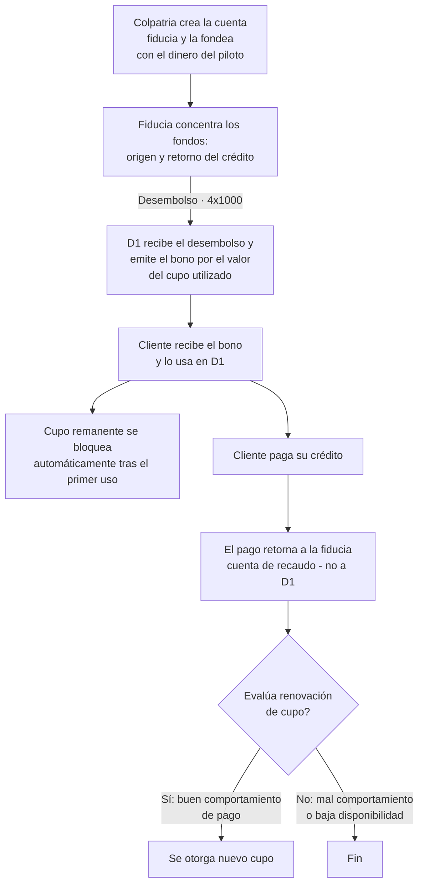

# 6. Dispersión de fondos

[← Volver a Procesos](README.md)

| Documento | Dispersión de fondos |
|-----------|-------------------------|
| **Proyecto** | Fliipa |
| **Versión** | 2.1 |
| **Estado** | Borrador para validación |
| **Responsable** | Riesgo y crédito / Tesorería |
| **Última actualización** | 2026-07-13 |

---

## Control de versiones

| Versión | Fecha | Autor | Descripción |
|---------|-------|-------|-------------|
| 1.0 | 2026-07-09 | María Fernanda Herazo  | Versión inicial, como sección 6 del `procesos.md` original (monolítico). |
| 2.0 | 2026-07-13 | María Fernanda Herazo  | Reorganización en archivo independiente con diagrama Mermaid, dentro del split de `negocio/procesos/`. |
| 2.1 | 2026-07-13 | María Fernanda Herazo | Corrección solicitada tras validar contra la página 8 de `Journeys Fran finales.pdf`: se agrega el paso inicial (Colpatria crea y fondea la cuenta fiducia); se corrige la dirección del desembolso — la fiducia **concentra** los fondos y los **gira hacia D1** (no los "recibe" de D1); se corrige la atribución de la emisión del bono, que hace **D1** (no la fiducia); se agrega el paso explícito "cliente paga su crédito"; se agrega la evaluación de renovación de cupo (Sí/No) al final del flujo, que faltaba por completo. |

---

Los fondos se administran mediante una **fiducia** constituida por el aliado de core bancario (Colpatria), que concentra el origen y el retorno del dinero del crédito.

## Flujo

> **Nota:** el bono se activa cuando un worker periódico detecta la compra del cliente en D1; ese es el disparador operativo detrás del paso "D1 recibe el desembolso y emite el bono" (no aparece como un nodo separado en el diagrama original, pero está confirmado en las notas de la página 8 del journey).

## Costo del GMF (4x1000)

| Concepto | Valor |
|----------|-------|
| GMF por giro de la fiducia a D1 | $4.000 por cada ciclo de $1.000.000 (0,4%) |
| Costo anual equivalente (12 ciclos sobre el mismo capital) | 4,8% anual |
| Ahorro posible | Si la fiducia se constituye en el mismo banco donde ya están los fondos, se evita el 4x1000 del fondeo inicial |

> **Nota de alcance:** la evaluación de renovación de cupo (H) también está documentada en [07-uso-renovacion-cupo.md](07-uso-renovacion-cupo.md); se repite aquí porque así aparece en el mismo diagrama de la página 8 del journey. Conviene mantener ambas versiones alineadas si alguna cambia.

## Fuentes consultadas

- `Journeys Fran finales.pdf` (Journeys Colpatria B2B, junio 2026), página 8 ("Flujo de dispersión", swimlanes Colpatria / Fiducia / D1 / Cliente)
