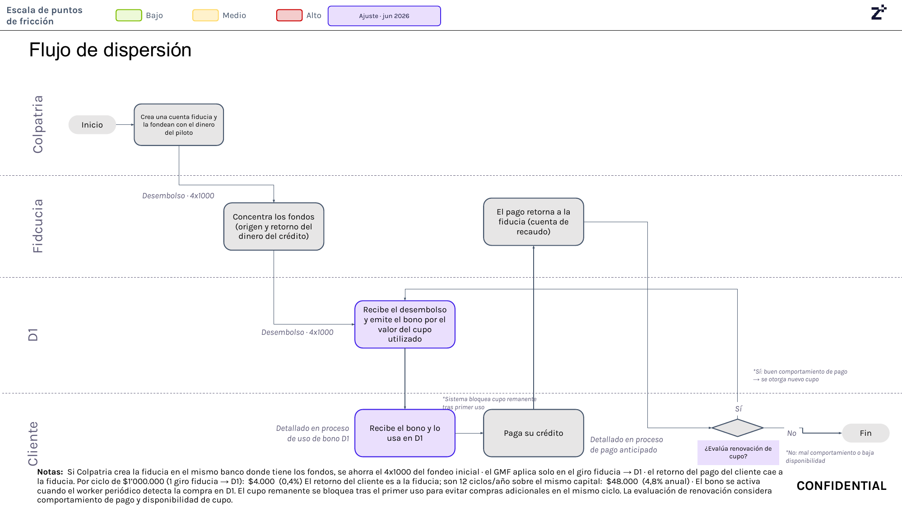

# 6. Dispersión de fondos

[← Volver a Procesos](README.md)

| Documento | Dispersión de fondos |
|-----------|-------------------------|
| **Proyecto** | Fliipa |
| **Versión** | 2.1 |
| **Estado** | Borrador para validación |
| **Responsable** | Riesgo y crédito / Tesorería |
| **Última actualización** | 2026-07-13 |

---

## Control de versiones

| Versión | Fecha | Autor | Descripción |
|---------|-------|-------|-------------|
| 1.0 | 2026-07-09 | María Fernanda Herazo  | Versión inicial, como sección 6 del `procesos.md` original (monolítico). |
| 2.0 | 2026-07-13 | María Fernanda Herazo  | Reorganización en archivo independiente con diagrama Mermaid, dentro del split de `negocio/procesos/`. |
| 2.1 | 2026-07-13 | María Fernanda Herazo | Corrección solicitada tras validar contra la página 8 de `Journeys Fran finales.pdf`: se agrega el paso inicial (Colpatria crea y fondea la cuenta fiducia); se corrige la dirección del desembolso — la fiducia **concentra** los fondos y los **gira hacia D1** (no los "recibe" de D1); se corrige la atribución de la emisión del bono, que hace **D1** (no la fiducia); se agrega el paso explícito "cliente paga su crédito"; se agrega la evaluación de renovación de cupo (Sí/No) al final del flujo, que faltaba por completo. |

## Objetivo

Gestionar el desembolso de fondos, la activación del bono y el retorno del pago para que el crédito quede operativo y, cuando aplique, se evalúe la renovación del cupo.

## Descripción general

Los fondos se administran mediante una fiducia constituida por el aliado de core bancario (Colpatria), que concentra el origen y el retorno del dinero del crédito. El flujo inicia con el fondeo de la cuenta fiducia, continúa con el giro hacia D1 para activar el bono y termina con el pago del cliente y la evaluación de renovación del cupo.

## Actores involucrados

- Colpatria: crea y fondea la cuenta fiducia.
- Fiducia: concentra los fondos y recibe el retorno del crédito.
- D1: recibe el desembolso, emite el bono y activa su uso en la plataforma.
- Cliente: recibe el bono, lo usa y paga el crédito.
- Tesorería y riesgo: supervisan la operación y la continuidad del cupo.

## Journey

El recorrido se explica a continuación en texto narrativo, y la imagen del journey sirve como referencia visual para validar la secuencia operativa.

- Página 8 del journey Colpatria B2B (junio 2026): dispersión de fondos, fiducia, GMF 4x1000 y bloqueo de cupo.
- Fuente visual de respaldo para validar la secuencia documentada en este proceso.

## Explicación del Journey

1. Creación y fondeo de la cuenta fiducia
   - Qué sucede: Colpatria crea la cuenta fiducia y la fondea con los recursos del piloto.
   - Qué actor interviene: Colpatria.
   - Qué sistema participa: cuentas de fiducia y operación de tesorería.
   - Qué información se utiliza: monto del piloto y condiciones del crédito.
   - Qué decisión se toma: si la cuenta está lista para operar.
   - Qué ocurre si el resultado es positivo: se concentra el dinero del crédito.
   - Qué ocurre si el resultado es negativo: el desembolso no se ejecuta.

2. Concentración de fondos por la fiducia
   - Qué sucede: la fiducia concentra la fuente y el retorno del dinero del crédito.
   - Qué actor interviene: fiducia.
   - Qué sistema participa: operación de tesorería y cuentas de recaudo.
   - Qué información se utiliza: originación y retorno del crédito.
   - Qué decisión se toma: si el flujo financiero está listo para girar fondos.
   - Qué ocurre si el resultado es positivo: se ejecuta el desembolso a D1.
   - Qué ocurre si el resultado es negativo: la operación queda pendiente.

3. Desembolso y emisión del bono
   - Qué sucede: la fiducia gira los fondos a D1 y este emite el bono asociado al cupo utilizado.
   - Qué actor interviene: D1 y fiducia.
   - Qué sistema participa: proceso de desembolso y activación del bono.
   - Qué información se utiliza: valor del cupo utilizado y estado de la operación.
   - Qué decisión se toma: si el bono se activa correctamente.
   - Qué ocurre si el resultado es positivo: el cliente recibe el bono.
   - Qué ocurre si el resultado es negativo: se detiene la activación del cupo.

4. Uso del bono por parte del cliente
   - Qué sucede: el cliente recibe el bono y lo usa en D1.
   - Qué actor interviene: cliente y D1.
   - Qué sistema participa: plataforma de uso del bono.
   - Qué información se utiliza: bono emitido y transacción del cliente.
   - Qué decisión se toma: si la compra se registra como uso del crédito.
   - Qué ocurre si el resultado es positivo: el cupo remanente se bloquea automáticamente.
   - Qué ocurre si el resultado es negativo: la operación no se consolida.

5. Pago del crédito
   - Qué sucede: el cliente paga su crédito después de haber usado el bono.
   - Qué actor interviene: cliente.
   - Qué sistema participa: flujo de recaudo y pagos.
   - Qué información se utiliza: saldo del crédito y fecha de pago.
   - Qué decisión se toma: si el pago se registra adecuadamente.
   - Qué ocurre si el resultado es positivo: el dinero retorna a la fiducia.
   - Qué ocurre si el resultado es negativo: se activa seguimiento de cobranza.

6. Evaluación de renovación del cupo
   - Qué sucede: el sistema evalúa si se otorga un nuevo cupo según el comportamiento de pago y la disponibilidad del cupo.
   - Qué actor interviene: sistema y riesgo.
   - Qué sistema participa: motor de renovación del cupo.
   - Qué información se utiliza: comportamiento de pago y disponibilidad del cupo.
   - Qué decisión se toma: si el cliente califica para una nueva asignación.
   - Qué ocurre si el resultado es positivo: se otorga nuevo cupo.
   - Qué ocurre si el resultado es negativo: finaliza el proceso sin renovación.

## Reglas de negocio

- La cuenta fiducia debe crearse y fondearse antes del desembolso.
- El giro de fondos va de la fiducia a D1 para activar el bono.
- El pago del crédito retorna a la fiducia, no a D1.
- El cupo remanente se bloquea automáticamente tras el primer uso.
- La renovación del cupo depende del comportamiento de pago y de la disponibilidad de cupo.

## Entradas

- Fondos para el piloto y cuenta fiducia creada.
- Monto del cupo utilizado y estado del crédito.
- Compra del cliente en D1 para activar el bono.
- Pago del cliente y estado de la cartera.

## Salidas

- Desembolso ejecutado y bono emitido.
- Pago del crédito retornado a la fiducia.
- Decisión de renovación del cupo según la política vigente.

## Excepciones

- La cuenta fiducia no se crea o no se fondea.
- No se ejecuta el desembolso a D1.
- El cliente no usa el bono o no paga el crédito.
- La renovación del cupo no aplica por mal comportamiento o falta de disponibilidad.

## Consideraciones

- El bono se activa cuando un worker periódico detecta la compra del cliente en D1.
- El costo del GMF 4x1000 es relevante para la operación del flujo financiero.
- La evaluación de renovación se documenta también en [07-uso-renovacion-cupo.md](07-uso-renovacion-cupo.md).

## Pendientes de validación

> **Pendiente de validar con el dueño del proceso.** La política exacta de renovación del cupo y el tratamiento de la cuenta fiducia deben confirmarse con tesorería y negocio.

## Costo del GMF (4x1000)

| Concepto | Valor |
|----------|-------|
| GMF por giro de la fiducia a D1 | $4.000 por cada ciclo de $1.000.000 (0,4%) |
| Costo anual equivalente (12 ciclos sobre el mismo capital) | 4,8% anual |
| Ahorro posible | Si la fiducia se constituye en el mismo banco donde ya están los fondos, se evita el 4x1000 del fondeo inicial |

## Fuentes consultadas

- `Journeys Fran finales.pdf` (Journeys Colpatria B2B, junio 2026), página 8 ("Flujo de dispersión", swimlanes Colpatria / Fiducia / D1 / Cliente)

