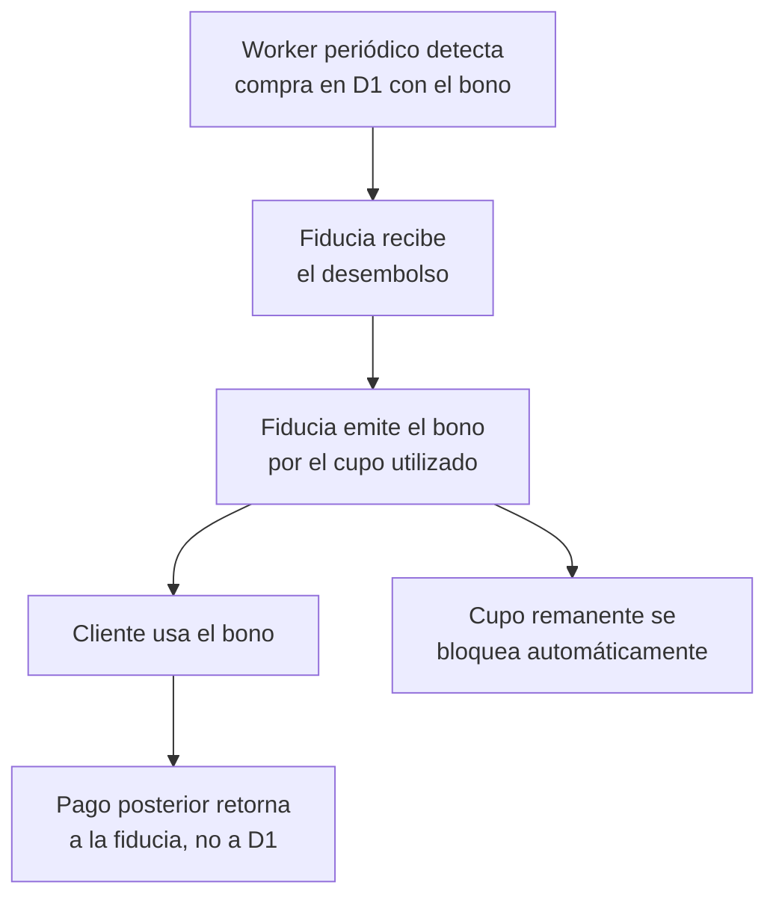

# 6. Dispersión de fondos

[← Volver a Procesos](README.md)

Los fondos se administran mediante una **fiducia** constituida por el aliado de core bancario (Colpatria), que concentra el origen y el retorno del dinero del crédito.

## Flujo

## Costo del GMF (4x1000)

| Concepto | Valor |
|----------|-------|
| GMF por giro de la fiducia a D1 | $4.000 por cada ciclo de $1.000.000 (0,4%) |
| Costo anual equivalente (12 ciclos sobre el mismo capital) | 4,8% anual |
| Ahorro posible | Si la fiducia se constituye en el mismo banco donde ya están los fondos, se evita el 4x1000 del fondeo inicial |
